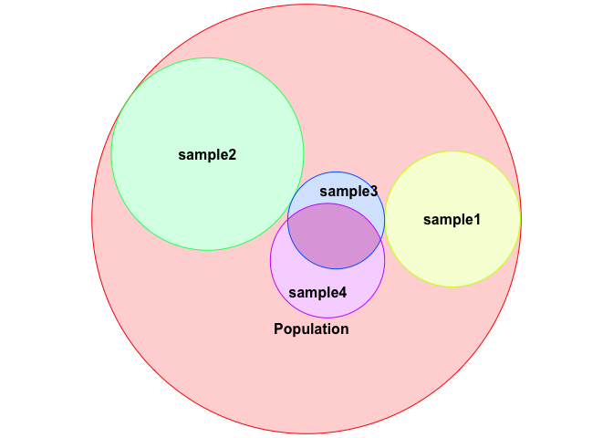
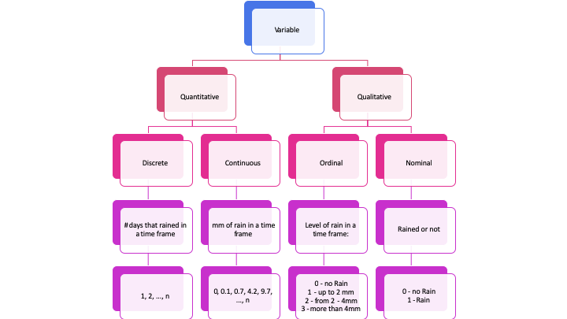

# Goals of this module
{: .no_toc }

## Table of contents
{: .no_toc .text-delta }

1. TOC
{:toc}

---
The goal of this module is to introduce basic concepts of statistics and how to make the correct interpretation of the results. Moreover, you will be able to construct your own functions to analyse your data. 

## What is statistics? 
*Statistics* is the part of the scientific method that aims to *collect*, *reduce*, *analyse* and *model real data*. Statistics helps the analyse and presentation of data, and is also involved with the design of experiments, planning and defining how to collect the data in order to achieve results with *minimal errors*.

In the end, the statistical analysis should be able to tell us something concrete about the sample that we are studying and allow us to make *inferences* towards a population.


<!-- -->


Statistics is normally divided into two main parts:
*Descriptive statistics* and *Inferential statistics*.
The descriptive analysis gives an *overview* about the sample and the inferential analysis tests hypothesis about the population.

Before we can understand **what** the data is revealing us, we have to be able to split the variables	into	their	correct	categories. 

### Types of variables
The variables can be classified into two main groups:

1. **Qualitative** or **Categorical**
- i. **Nominal** (There are no order for the labels)
- i.e. Country, Gender, Brand of preference, Sides of a coin.
- ii. **Ordinal** (There are an order on the labels)
- i.e. Degree, State of a disease.

2. **Quantitative** or **Numerical**
- i. **Discrete** (Countable)
-  i.e. The number of kids, Number of births/deaths.
- ii. **Continuous**
- i.e. Temperature, Age.




In this course, we will use as an example, the data from GSE$5388$, a data set containing data from controls and patients with Bipolar Disorder, some phenotypic information and the log transform of the gene expression of few genes.

* Link to the data: [Pheno_DE.csv](https://raw.githubusercontent.com/deisygysi/EVOP_2019/master/docs/Data/Pheno_DE.csv).


```r
require(data.table)
```

```
## Loading required package: data.table
```

```r
data = fread("./Pheno_DE.csv", header = T)
```


```r
head(data)
```

```
##    V1         X Age_death Age_onset Alcohol_abuse Brain_ph           Status
## 1:  1 GSM123182        41        21             4     6.60 Bipolar disorder
## 2:  2 GSM123183        51        23             3     6.67 Bipolar disorder
## 3:  3 GSM123184        29        17             5     6.70 Bipolar disorder
## 4:  4 GSM123185        45        16             5     6.03 Bipolar disorder
## 5:  5 GSM123186        45        35            NA     6.35 Bipolar disorder
## 6:  6 GSM123187        29        22             3     6.39 Bipolar disorder
##    Drug_abuse Duration_illness Therapy_Electroconvulsive Therapy_Fluphenazine
## 1:         NA               20                        No                 4000
## 2:         NA               28                        No                 1200
## 3:         NA               12                        No                    0
## 4:         NA               29                        No                20000
## 5:         NA               10                        No                10000
## 6:         NA                7                        No                 9000
##    Gender Therapy_Lithium Post_morten_interval Side_brain Suicide
## 1:   Male              No                   39       Left      No
## 2:   Male             Yes                   23      Right      No
## 3:   Male              No                   60       Left     Yes
## 4:   Male              No                   35       Left      No
## 5:   Male             Yes                   28      Right      No
## 6:   Male             Yes                   48       Left     Yes
##    Therapy_Valproate   APOLD1   CLDN10    DUSP4   EFEMP1   ETNPPL     GJA1
## 1:                No 2.152660 2.112543 1.444517 1.982179 2.176330 2.322113
## 2:               Yes 1.997211 1.928009 1.588566 1.682268 2.008312 2.013563
## 3:                No 1.948088 1.889068 1.647670 1.616167 2.000327 2.075701
## 4:                No 2.004866 1.990901 1.561431 1.834901 2.127770 2.185395
## 5:               Yes 2.115232 2.174190 1.500870 1.933025 2.192663 2.315789
## 6:                No 1.965658 2.110917 1.563595 1.893836 2.309126 2.298134
##      PLSCR4     SDC4  SLC14A1     SOX9      SST     TAC1   CX3CR1    DDX3Y
## 1: 2.077668 2.121310 1.525635 2.148748 2.159719 1.931646 1.827552 1.839211
## 2: 1.760068 1.854849 1.258381 1.866901 2.184970 1.847591 1.819232 1.730088
## 3: 1.700901 1.907488 1.207537 1.819381 2.277078 1.990829 1.961884 1.773730
## 4: 1.913064 1.971049 1.296940 2.064194 2.109886 2.029357 2.148501 1.829522
## 5: 1.912751 2.089236 1.310210 2.168561 2.041932 1.792311 1.810602 1.784885
## 6: 1.992631 2.106750 1.386407 2.117131 2.184146 1.851064 1.999240 1.814530
##    ETNPPL.1    G3BP2   GABRG2    KDM5D     MAFB     NBEA     OXR1     PAK1
## 1: 2.176330 1.978782 1.945828 2.034145 2.030666 2.175929 1.913865 1.655183
## 2: 2.008312 2.018350 2.039343 1.954309 1.735369 2.122118 1.896113 1.775980
## 3: 2.000327 1.904745 1.857377 1.959069 1.950146 2.122876 1.622148 1.447723
## 4: 2.127770 1.954061 1.964420 1.996484 1.950062 2.157232 1.989004 1.486036
## 5: 2.192663 1.993587 2.060480 2.013729 1.841878 2.120895 1.839516 1.758160
## 6: 2.309126 1.925121 1.972022 1.994736 1.922158 2.064510 2.004024 1.613972
##       PCDH8     PPID    PVALB   RPS4Y1    SST.1   TAC1.1  TBL1XR1    USP9Y
## 1: 2.075773 2.096918 2.069023 2.252762 2.159719 1.931646 1.805345 1.650953
## 2: 1.871192 1.910763 1.907661 2.249547 2.184970 1.847591 1.743102 1.479515
## 3: 2.074534 1.999264 2.057438 2.230230 2.277078 1.990829 1.636407 1.375200
## 4: 2.063902 1.993752 2.088463 2.273152 2.109886 2.029357 1.778514 1.486636
## 5: 1.987673 1.938930 2.073875 2.221096 2.041932 1.792311 1.844225 1.616611
## 6: 2.000520 1.996720 2.047750 2.229109 2.184146 1.851064 1.666795 1.481730
##        XIST
## 1: 1.500793
## 2: 1.460230
## 3: 1.475840
## 4: 1.474657
## 5: 1.449550
## 6: 1.443271
```


```r
data = data[,-1]
```


### Exercise {.tabset .tabset-fade .tabset-pills}
#### Exercise
1. Define the type of each variable in our data set.

#### Results


```r
str(data)
```

* Qualitative Nominal:
* X
* Status Disease
* Therapy (Eletroconvulcive, Valproate, Lithium)
* Qualitative Ordinal 
* Alchool abuse
* Drug abuse
* Quantative Discrete:
* Age (death and onset)
* Duration disease
* Therapy Fluphenazine
* Quantative Continuous:
* pH
* Genes