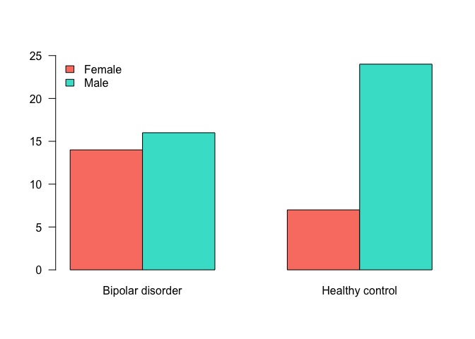
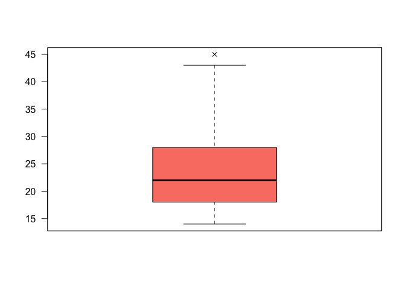
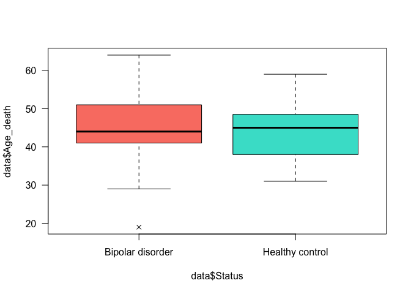
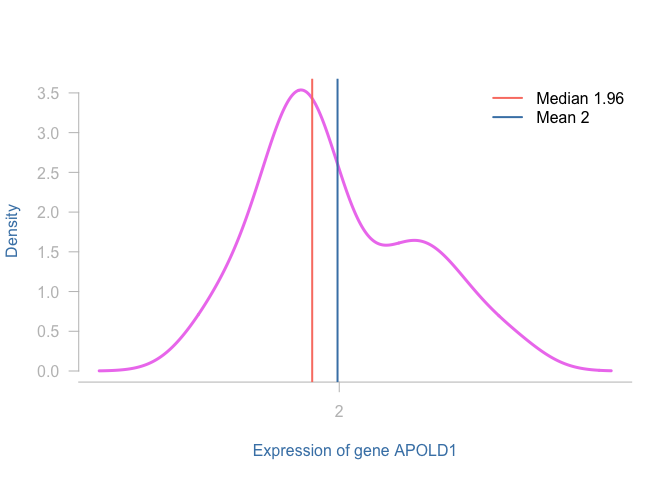
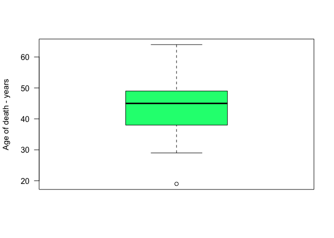
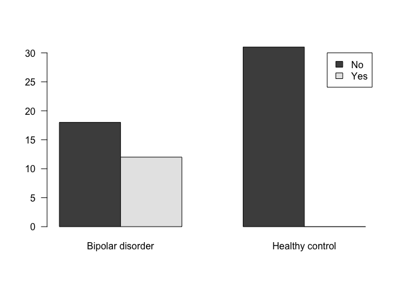

# Descriptive Statistics
{: .no_toc }


## Table of contents
{: .no_toc .text-delta }

1. TOC
{:toc}

---

### Frequency Tables
Frequency tables can be used for all kinds of variables, however, it's preferable to use them for the *categorical* ones. If you use it for numerical data, the variable's values have to be divided into *ranges*.

To get an *absolute frequency* table using R, 
the easiest way is by using the function `table()`, 
and for a relative frequency table `prop.table()`.


```r
table(data$Gender) 
```

```
## 
## Female   Male 
##     21     40
```


```r
table(data$Status)
```

```
## 
## Bipolar disorder  Healthy control 
##               30               31
```


```r
require(magrittr) # Allows using pipe inside R
```


```r
table(data$Gender) %>% # Pipes the absolute freq. table into
  prop.table()         # a relative freq. table
```

```
## 
##    Female      Male 
## 0.3442623 0.6557377
```


Try: What happens if we ask for a `prop.table()` on an object that is not a table?


```r
# prop.table(data$Gender)
```

The `table()` function also allows us to create cross-tables. For that, the input is two variables.


```r
table(data$Gender, data$Status)
```

```
##         
##          Bipolar disorder Healthy control
##   Female               14               7
##   Male                 16              24
```


```r
table(data$Gender, data$Status) %>% 
  prop.table(.) %>% 
  round(.,2)
```

```
##         
##          Bipolar disorder Healthy control
##   Female             0.23            0.11
##   Male               0.26            0.39
```

When the interest lies in visualising this results, the `barplot()` can be used to represent visually a frequency table.


```r
table(data$Gender, data$Status) %>% 
  barplot(., beside = TRUE, 
          legend.text = TRUE, 
          col = c('salmon','turquoise'), 
          args.legend = list(x = 'topleft',
                             bty = 'n'),
          ylim = c(0,25),
          las = 1)
```

<!-- -->


### Central tendency measures # 
**Central tendency measures** attempts to summarise/describe the dataset by its *central* position. 
The *mean*, *median* and *mode* are examples of central measurements.

The **five-number summary** is a set of descriptive statistics that provide information about a dataset. 
It consists of five quartiles:

1. $Q_0$ the lowest value of the sample, aka **Minimum**
1. $Q_1$ $25\%$ of the sample, aka **lower quantile**
1. $Q_2$ $50\%$ of the sample, aka **median**
1. $Q_3$ $75\%$ of the sample, aka **upper quantile**
1. $Q_4$ the biggest value of the sample, aka **Maximum**

The functions `summary()` and `fivenum()` returns the five-number summary. They are a bit different how they calculate the $1^{st}$ and $3^{rd}$ quantiles.
`summary()` calculates the average of the two numbers, if even, `fivenum()` returns the minimum. 


```r
### The function summary will give you an overview of the full data set if you want to!
summary(data)
```

```
##       X               Age_death       Age_onset     Alcohol_abuse  
##  Length:61          Min.   :19.00   Min.   :14.00   Min.   :0.000  
##  Class :character   1st Qu.:38.00   1st Qu.:18.25   1st Qu.:0.000  
##  Mode  :character   Median :45.00   Median :22.00   Median :1.000  
##                     Mean   :44.18   Mean   :24.03   Mean   :1.817  
##                     3rd Qu.:49.00   3rd Qu.:27.75   3rd Qu.:3.250  
##                     Max.   :64.00   Max.   :45.00   Max.   :5.000  
##                                     NA's   :31      NA's   :1      
##     Brain_ph        Status            Drug_abuse     Duration_illness
##  Min.   :5.920   Length:61          Min.   :0.0000   Min.   : 2.00   
##  1st Qu.:6.400   Class :character   1st Qu.:0.0000   1st Qu.:14.00   
##  Median :6.600   Mode  :character   Median :0.0000   Median :18.50   
##  Mean   :6.553                      Mean   :0.1935   Mean   :20.50   
##  3rd Qu.:6.740                      3rd Qu.:0.0000   3rd Qu.:27.75   
##  Max.   :7.030                      Max.   :3.0000   Max.   :45.00   
##                                     NA's   :30       NA's   :31      
##  Therapy_Electroconvulsive Therapy_Fluphenazine    Gender         
##  Length:61                 Min.   :     0       Length:61         
##  Class :character          1st Qu.:     0       Class :character  
##  Mode  :character          Median :  3000       Mode  :character  
##                            Mean   : 11283                         
##                            3rd Qu.: 12000                         
##                            Max.   :130000                         
##                            NA's   :32                             
##  Therapy_Lithium    Post_morten_interval  Side_brain          Suicide         
##  Length:61          Min.   : 9.00        Length:61          Length:61         
##  Class :character   1st Qu.:23.00        Class :character   Class :character  
##  Mode  :character   Median :31.00        Mode  :character   Mode  :character  
##                     Mean   :33.05                                             
##                     3rd Qu.:39.00                                             
##                     Max.   :84.00                                             
##                                                                               
##  Therapy_Valproate      APOLD1          CLDN10          DUSP4      
##  Length:61          Min.   :1.765   Min.   :1.822   Min.   :1.445  
##  Class :character   1st Qu.:1.917   1st Qu.:1.984   1st Qu.:1.522  
##  Mode  :character   Median :1.957   Median :2.042   Median :1.562  
##                     Mean   :1.997   Mean   :2.042   Mean   :1.573  
##                     3rd Qu.:2.113   3rd Qu.:2.113   3rd Qu.:1.632  
##                     Max.   :2.286   Max.   :2.181   Max.   :1.718  
##                                                                    
##      EFEMP1          ETNPPL           GJA1           PLSCR4     
##  Min.   :1.585   Min.   :1.903   Min.   :1.840   Min.   :1.683  
##  1st Qu.:1.766   1st Qu.:2.115   1st Qu.:2.154   1st Qu.:1.861  
##  Median :1.847   Median :2.194   Median :2.235   Median :1.905  
##  Mean   :1.835   Mean   :2.183   Mean   :2.219   Mean   :1.903  
##  3rd Qu.:1.916   3rd Qu.:2.278   3rd Qu.:2.309   3rd Qu.:1.971  
##  Max.   :2.049   Max.   :2.367   Max.   :2.409   Max.   :2.079  
##                                                                 
##       SDC4          SLC14A1           SOX9            SST       
##  Min.   :1.740   Min.   :1.156   Min.   :1.819   Min.   :1.782  
##  1st Qu.:1.984   1st Qu.:1.291   1st Qu.:1.981   1st Qu.:2.083  
##  Median :2.028   Median :1.320   Median :2.063   Median :2.172  
##  Mean   :2.021   Mean   :1.340   Mean   :2.040   Mean   :2.137  
##  3rd Qu.:2.087   3rd Qu.:1.400   3rd Qu.:2.109   3rd Qu.:2.206  
##  Max.   :2.178   Max.   :1.669   Max.   :2.237   Max.   :2.277  
##                                                                 
##       TAC1           CX3CR1          DDX3Y          ETNPPL.1    
##  Min.   :1.549   Min.   :1.749   Min.   :1.397   Min.   :1.903  
##  1st Qu.:1.837   1st Qu.:1.865   1st Qu.:1.484   1st Qu.:2.115  
##  Median :1.911   Median :1.979   Median :1.764   Median :2.194  
##  Mean   :1.885   Mean   :1.974   Mean   :1.674   Mean   :2.183  
##  3rd Qu.:1.974   3rd Qu.:2.072   3rd Qu.:1.807   3rd Qu.:2.278  
##  Max.   :2.071   Max.   :2.263   Max.   :1.891   Max.   :2.367  
##                                                                 
##      G3BP2           GABRG2          KDM5D            MAFB      
##  Min.   :1.790   Min.   :1.722   Min.   :1.494   Min.   :1.660  
##  1st Qu.:1.937   1st Qu.:1.974   1st Qu.:1.677   1st Qu.:1.869  
##  Median :1.994   Median :2.088   Median :1.959   Median :1.919  
##  Mean   :1.988   Mean   :2.061   Mean   :1.863   Mean   :1.900  
##  3rd Qu.:2.044   3rd Qu.:2.166   3rd Qu.:2.000   3rd Qu.:1.951  
##  Max.   :2.117   Max.   :2.245   Max.   :2.054   Max.   :2.047  
##                                                                 
##       NBEA            OXR1            PAK1           PCDH8      
##  Min.   :1.868   Min.   :1.622   Min.   :1.333   Min.   :1.727  
##  1st Qu.:2.089   1st Qu.:1.896   1st Qu.:1.584   1st Qu.:1.941  
##  Median :2.110   Median :1.983   Median :1.709   Median :1.997  
##  Mean   :2.094   Mean   :1.951   Mean   :1.679   Mean   :1.986  
##  3rd Qu.:2.143   3rd Qu.:2.030   3rd Qu.:1.784   3rd Qu.:2.053  
##  Max.   :2.202   Max.   :2.151   Max.   :1.901   Max.   :2.113  
##                                                                 
##       PPID           PVALB           RPS4Y1          SST.1      
##  Min.   :1.808   Min.   :1.779   Min.   :1.640   Min.   :1.782  
##  1st Qu.:1.986   1st Qu.:1.987   1st Qu.:1.768   1st Qu.:2.083  
##  Median :2.017   Median :2.052   Median :2.227   Median :2.172  
##  Mean   :2.004   Mean   :2.030   Mean   :2.065   Mean   :2.137  
##  3rd Qu.:2.051   3rd Qu.:2.087   3rd Qu.:2.248   3rd Qu.:2.206  
##  Max.   :2.109   Max.   :2.154   Max.   :2.280   Max.   :2.277  
##                                                                 
##      TAC1.1         TBL1XR1          USP9Y            XIST      
##  Min.   :1.549   Min.   :1.504   Min.   :1.160   Min.   :1.424  
##  1st Qu.:1.837   1st Qu.:1.742   1st Qu.:1.293   1st Qu.:1.462  
##  Median :1.911   Median :1.805   Median :1.483   Median :1.497  
##  Mean   :1.885   Mean   :1.789   Mean   :1.454   Mean   :1.701  
##  3rd Qu.:1.974   3rd Qu.:1.856   3rd Qu.:1.589   3rd Qu.:2.106  
##  Max.   :2.071   Max.   :1.990   Max.   :1.796   Max.   :2.264  
## 
```


```r
### or just the variable you want.
summary(data$Age_death)
```

```
##    Min. 1st Qu.  Median    Mean 3rd Qu.    Max. 
##   19.00   38.00   45.00   44.18   49.00   64.00
```


```r
###  (minimum, lower-hinge, median, upper-hinge, maximum)
fivenum(data$Age_death)
```

```
## [1] 19 38 45 49 64
```

The graphical representation of the summary is the `boxplot()`.


```r
boxplot(data$Age_onset, 
        las = 2, 
        pch = 4,
        col = 'salmon')
```

<!-- -->

If we are interested in the summary **by** condition, we can use the function `by()`.


```r
by(data, data$Status, 
   FUN = summary)
```


The `boxplot()` can also be done for two different categories:


```r
boxplot(data$Age_death ~ data$Status, 
        las = 1, pch = 4, 
        col = c('salmon', 'turquoise'))
```

<!-- -->

#### Mean
It is calculated by taking the sum of the values and dividing by the total number of values of the data. 
The function `mean()` can be used to calculate the average.


```r
mean(data$Age_death)
```

```
## [1] 44.18033
```


**Interpretation**: The average age of death in this study was 
44.18.


The functions `colMeans()` and `rowMeans()` can be also used for computing the mean of columns and rows.


```r
colMeans(data[,c(17:28)], na.rm = T)
```

```
##   APOLD1   CLDN10    DUSP4   EFEMP1   ETNPPL     GJA1   PLSCR4     SDC4 
## 1.997240 2.041634 1.572833 1.834842 2.183101 2.219369 1.902763 2.020990 
##  SLC14A1     SOX9      SST     TAC1 
## 1.339995 2.039741 2.137336 1.885281
```

```r
rowMeans(data[,17:28], na.rm = T)
```

```
##  [1] 2.012922 1.832557 1.840020 1.924146 1.962231 1.981616 1.945479 1.928857
##  [9] 1.941477 2.000882 1.874723 1.904858 1.995695 1.974847 1.949153 1.918931
## [17] 1.934290 1.987450 1.958006 1.968084 1.991263 1.920940 1.984736 1.907677
## [25] 1.984528 1.895546 1.952010 1.934318 1.876073 1.858500 1.876398 1.942668
## [33] 1.885970 1.878481 1.817041 1.931009 1.960738 1.963836 1.923612 1.764979
## [41] 1.916670 1.990174 1.864843 1.881532 1.986587 2.011588 1.996816 1.922206
## [49] 1.888220 1.991758 1.944774 1.978649 1.859148 1.978678 1.982875 1.994539
## [57] 1.851342 2.051429 1.809602 1.921640 1.897267
```


#### Median
The	**median**	is	the	**middle** value	when	a	variable	is	sorted, the function`median()` computes it in R. When dealing with variables that are not symmetrically distributed, it is important to describe the variable by its median.


```r
median(data$Age_death)
```

```
## [1] 45
```


**Interpretation**: The mid-age of death in this study was `45`. This means that this is the value that divides the data in half.

Note that in the case of non-symmetry, the median is not the same as the mean!


```r
plot((density(data$APOLD1))$x,(density(data$APOLD1))$y, 
     type = "l", 
     xlab = "Expression of gene APOLD1",
     ylab = "Density", 
     las = 2, 
     axes = F, 
     col = "violet", 
     lwd = 3, 
     col.lab = "steelblue")
axis(1, 
     at = seq(from = (round(min(data$APOLD1))-2), by = 2, to = (2+round(max(data$APOLD1)))), 
     col = "gray75",  
     col.axis = "gray75")
axis(2, 
     las = 2, 
     col = "gray75", 
     col.ticks = "gray75", 
     col.axis = "gray75")
abline(v = median(data$APOLD1), 
       col = "salmon", 
       lwd = 2)
abline(v = mean(data$APOLD1), 
       col = "steelblue", 
       lwd = 2)
legend("topright", 
       c(paste("Median", round(median(data$APOLD1),2)), paste("Mean", round(mean(data$APOLD1),2))), 
       col = c("salmon", "steelblue"), 
       lwd = 2, 
       bty = "n")
```

<!-- -->


#### Mode

The mode is the value that appears **the most on a variable**. Sometimes, a variable might have more than one mode, but we won't deal with it here.

Unfortunately, there is no function on R to compute the mode. However, we can construct our own function. By the definition, it is the value that appears the most, so, let's create a table. 


```r
Mode = function(VAR){
  actual_mode <- table(VAR) 
  NAME = names(actual_mode)[actual_mode == max(actual_mode)]
  VAL = actual_mode[actual_mode == max(actual_mode)]
  return( data.frame(Value = NAME, Frequency = VAL))
}
```


```r
Mode(data$Age_onset)
```

```
##    Value Frequency
## 25    25         3
```


**Interpretation**: The most common age where people were diagnosed with bipolar disorder was `25` years.


### Dispersion measures # 
The dispersion refers to *how the values are spread* from the central data. It is as important as the central tendency values. Some of them are *Range*, *IQR*, *Variance* and *standard deviation*.

#### Range
The range is the difference between the largest and the smallest value of a variable. It means that is the range between the minimum and the maximum of a variable.
The function `range()` returns the minimum and maximum values, to have the range we have to use the function `diff()`.


```r
range(data$Age_death) %>% 
  diff(.)
```

```
## [1] 45
```

**Interpretation**: The difference (or the range) among the ages in our study was 45 years.

#### Interquartile range (IQR)
Is the difference between the third and the first quartiles. It's used to read and draw the boxplots. When dealing with non-symmetrical variables, it is also used to describe its dispersion, instead of using the standard deviation. 

On R we can use the function `IQR()`


```r
IQR(data$Age_death)
```

```
## [1] 11
```

**Interpretation**: The Interval interquantile is ``11``. It means that the distance between the $1^{st}$ and $3^{rd}$ quantiles is ``11`` years. This value can be used to make the interpretation of the boxplot.


```r
boxplot(data$Age_death , 
        col = c ("springgreen"), 
        ylab = "Age of death - years", 
        las = 2)
```

<!-- -->


```r
quantile(data$Age_death)
```

```
##   0%  25%  50%  75% 100% 
##   19   38   45   49   64
```


#### Variance
Variance is the expectation of the squared deviation of a random variable from its mean. In other words, the variance is how far the values are from the mean. We can calculate it using the function `var()`.


```r
var(data$Age_death)
```

```
## [1] 82.38361
```

**Interpretation**: The age of the individuals in our study deviates from the mean in ``82.38`` years$^2$ (quadratic scale).
However, it is quite hard to make interpretations in years$^2$.

#### Standard deviation (SD)
Is how the values are spread around the mean. It is given by the square root of the variance. A low standard deviation indicates that the data points tend to be close to the mean, while a high standard deviation indicates that the data points are spread out over a wider range of values. To compute the SD using R we can use the function `sd()`.


```r
sd(data$Age_death)
```

```
## [1] 9.076542
```

```r
sqrt(var(data$Age_death))
```

```
## [1] 9.076542
```


**Interpretation**: The age of the individuals in our study deviates from the mean in `9.08` years (data scale).

#### Coefficient of variation
The coefficient of variation is the sd divided by the mean. In chemistry is widely used to express the precision and repeatability of an experiment. Normally it is expressed as a percentage. The CV aims to describe the dispersion of the variable in a way that does not depend on the variable's measurement unit. The higher the CV, the greater the dispersion in the variable.

It's also used to compare the variation of variables that are not on the same scale.

The R doesn't have a function to compute it, but we can easily create our own.


```r
sd(data$Age_death)/mean(data$Age_death)*100
```

```
## [1] 20.54431
```

```r
CV <- function(VAR){
  (sd(VAR, na.rm = T)/mean(VAR, na.rm = T))*100
}
```


```r
CV(data$Age_death)
```

```
## [1] 20.54431
```

### Exercise {.tabset .tabset-fade .tabset-pills}
#### Exercises
1. Make absolute and relative frequency tables for the variables: Gender and Status. 

1. Check how many people that suffered from Bipolar Disorder committed suicide. Visualise it using a barplot. 

2. Compute and make the correct interpretations for the mean, median, IQR, standard deviation, variance and CV for **all the quantitative variables**. Tipp: You can create a function for that!

3. Compute and make the correct interpretations for the mean, median, IQR, standard deviation, variance and CV for all the numeric variables **only for Males**. Tipp: Use the function created before on a subset of the dataset.

4. Compute and make the correct interpretations for the mean, median, IQR, standard deviation, variance and CV for all the quantitative variables for **both conditions separately**. Tipp: Use the function created before; use the function `by()`.

#### Results
1. Make absolute and relative frequency tables for the variables: Gender and Status. 


```r
table(data$Gender, data$Status)
```

```
##         
##          Bipolar disorder Healthy control
##   Female               14               7
##   Male                 16              24
```

```r
table(data$Gender, data$Status) %>%
  prop.table() %>% 
  round(., digits = 4) * 100
```

```
##         
##          Bipolar disorder Healthy control
##   Female            22.95           11.48
##   Male              26.23           39.34
```


2. Check how many people that suffered from Bipolar Disorder committed suicide. Visualise it using a barplot. 


```r
table(data$Suicide, data$Status)
```

```
##      
##       Bipolar disorder Healthy control
##   No                18              31
##   Yes               12               0
```

```r
table(data$Suicide, data$Status) %>% 
  barplot(., beside = TRUE, 
          las = 1, 
          legend.text = TRUE)
```

<!-- -->

3. Compute and make the correct interpretations for the mean, median, IQR, standard deviation, variance and CV for **all the quantitative variables**. Tipp: You can create a function for that!


```r
# Create a basic function
mySummary <- function(myVar){
  
  myMean = mean(myVar, na.rm = T)
  myMedian = median(myVar, na.rm = T)
  myIQR = IQR(myVar, na.rm = T)
  mySd = sd(myVar, na.rm = T)
  myVar = var(myVar, na.rm = T)
  myCV = mySd/myMean * 100
  
  Output = cbind(myMean, myMedian, myIQR, mySd, myVar, myCV)
  return(Output)
}

Quantitative = data[,c(2:3,5,8,10,13,17:47)]
Result = apply(Quantitative,2,mySummary)
```


4. Compute and make the correct interpretations for the mean, median, IQR, standard deviation, variance and CV for all the numeric variables **only for Males**. Tipp: Use the function created before on a subset of the dataset.


```r
Quantitative = data[,c(2:3,5,8,10,13,17:47)]
Result_Male = subset(Quantitative, data$Gender == "Male") %>%
  apply(.,2,mySummary)
```


5. Compute and make the correct interpretations for the mean, median, IQR, standard deviation, variance and CV for all the quantitative variables for **both conditions separately**. Tipp: Use the function created before; use the function `by()`.


```r
Quantitative = data[,c(2:3,5,8,10,13,17:47)] %>% as.data.frame()
Out = list()
for(i in 1: ncol(Quantitative)){
  myvector = Quantitative[,i] %>% as.numeric()
  Out_tmp=  by(myvector, data$Status, mySummary, simplify = T)
  Out_tmp %<>% unlist %>% matrix(., nrow = 2, byrow = T) %>% as.data.frame()
  names(Out_tmp) = c("mean", "median", "IQR", "sd", "Var", "CV")
  rownames(Out_tmp) = c("Bipolar disorder", "Healthy control")
  rownames(Out_tmp) = paste(names(Quantitative)[i], row.names(Out_tmp), sep = "_")
  
  Out_tmp$Var = rownames(Out_tmp)
  Out[[i]] = Out_tmp
}

Final = data.table::rbindlist(Out)

head(Final)
```

```
##         mean median   IQR         sd                        Var        CV
## 1: 44.533333 44.000  9.75 10.7084669 Age_death_Bipolar disorder 24.045959
## 2: 43.838710 45.000 10.50  7.3261940  Age_death_Healthy control 16.711701
## 3: 24.033333 22.000  9.50  7.9110718 Age_onset_Bipolar disorder 32.917081
## 4:       NaN     NA    NA         NA  Age_onset_Healthy control        NA
## 5:  6.475000  6.505  0.31  0.2743236  Brain_ph_Bipolar disorder  4.236658
## 6:  6.628387  6.700  0.31  0.2663844   Brain_ph_Healthy control  4.018842
```
