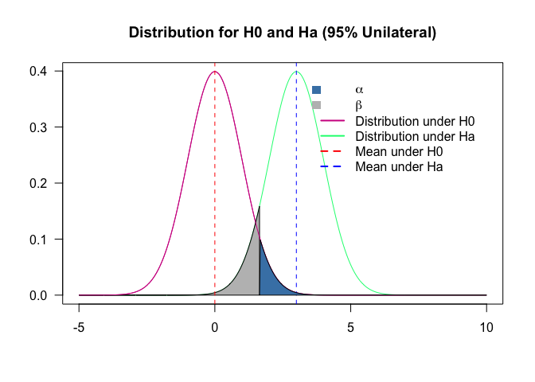
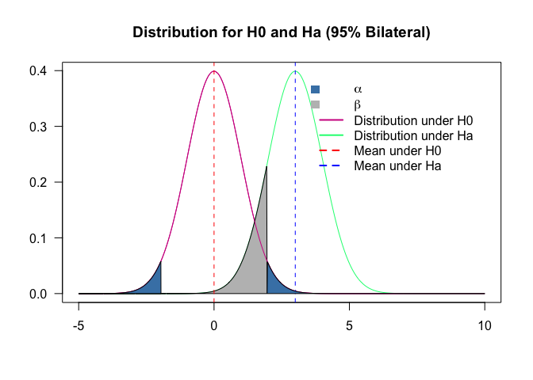
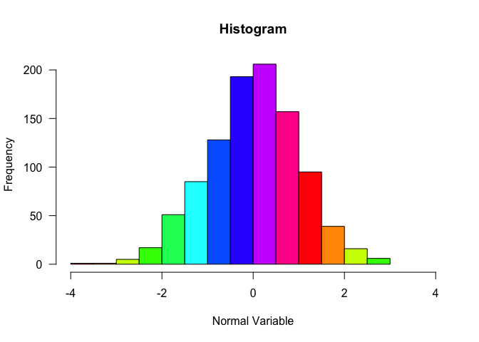
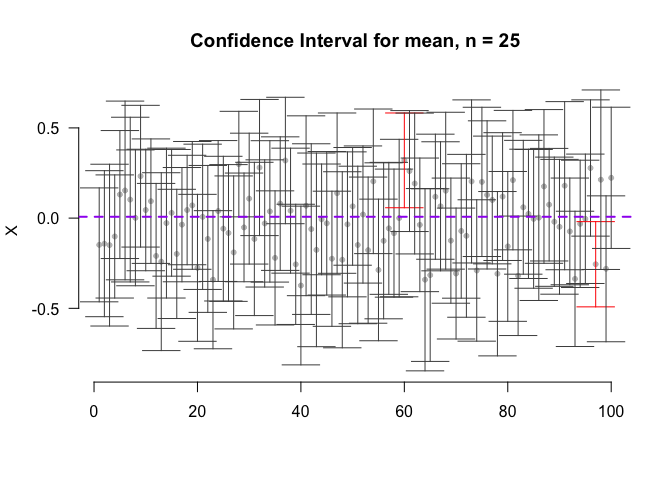
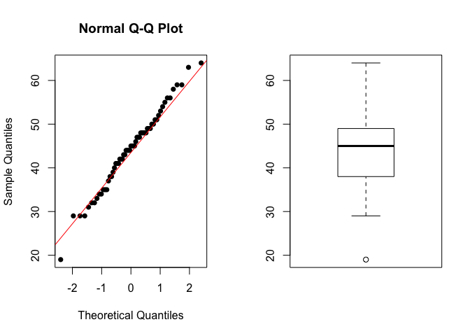
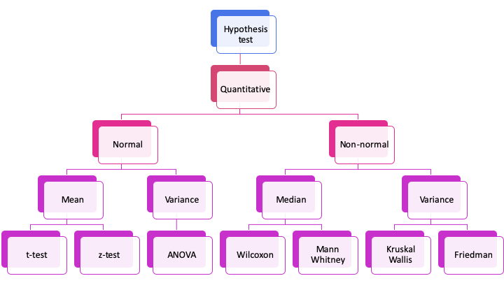

# Hypothesis testing
{: .no_toc }


## Table of contents
{: .no_toc .text-delta }

1. TOC
{:toc}

---
## Hypothesis Testing #  

A statistical hypothesis is an assumption about a population parameter. This assumption may or may not be true.
In traditional / frequentist Statistics there are two different statistical hypotheses:

* **Null hypothesis**: denoted by $H_0$ or H0, is usually the hypothesis that sample observations result **purely from chance**. In general, it is an equality assumption.

* **Alternative hypothesis**: denoted by $H_1$ or $H_a$, is the hypothesis that sample observations are influenced by some non-random cause. In general, it is inequality, superiority, or inferiority.

There are two outcomes from Hypothesis testing:

1. **Rejection the null hypothesis**;
1. **Fail to reject the null hypothesis**. The null hypothesis is never accepted. Failing to reject means that the data are not sufficiently persuasive for us to prefer the alternative hypothesis over the null hypothesis.

### Steps to test a null hypothesis 

1. **State the hypotheses**. This involves stating the null and alternative hypotheses. The hypotheses are stated in such a way that they are mutually exclusive. That is, if one is true, the other must be false.
2. **Define the analysis plan**. The analysis plan describes how to use sample data to evaluate the null hypothesis. The evaluation often focuses on a single test statistic.
3. **Analyse sample data**. Find the value of the test statistic (mean score, proportion, t statistic, z-score, etc.) described in the analysis plan. At this point, you also determine your significance level.
4. **Make the interpretation of the results**. Apply the decision rule described in the analysis plan. If the value of the test statistic is improbable, based on the null hypothesis, reject the null hypothesis.

The hypothesis is measured using a statistic, that, in other words, is a probabilistic way to measure it.

* **Example**: We want to know if the two groups in our example are different. Different in which sense? Let's say mean of ages. If they are not the same under H0, it means, the mean of both groups is different, the probability of having the same mean is small.

Again. We have 4 steps:

1. What is the hypothesis?
1. What is the statistics?
1. What is the significance level?
1. Results? Interpretation.

### Type I and type II errors
Two types of errors are possible are possible from testing a hypothesis: **type I** and **type II**. 
The risks of these two errors are inversely related and determined by the **level of significance** and the **power of the test**.

* **Type I error**: occurs when the **null hypothesis is rejected when it is true**, it the **false positive**. The probability of committing a Type I error is called the significance level. This probability is also called alpha and is often denoted by $\alpha$.

* **Type II error**: occurs when the **null hypothesis is failed to be rejected when it is false**, it is the **false negative**. The probability of committing a Type II error is called Beta and is often denoted by $\beta$. The probability of not committing a Type II error is called the Power of the test.

| Error types                         |                | Null hypothesis (H0) is                                   |                                                           |
|-------------------------------------|----------------|-----------------------------------------------------------|-----------------------------------------------------------|
|                                     |                | TRUE                                                      | FALSE                                                     |
| Decision About Null Hypothesis (H0) | Reject         | Type I error (False Positive) Probability = $\alpha$      | Correct inference (True Negative) Probability = $1 - \beta$ |
|                                     | Fail to reject | Correct inference (True Positive) Probability = $1 - \alpha$ | Type II error (False Negative) Probability = $\beta$      |


```r
mu1 = 0
mu2 = 3
sd1 = 1
sd2 = 1

p = seq(-5, 10, length.out = 500)
x1 = p %>% dnorm(., mean = mu1, sd = sd1) # %>%
x2 = p %>% dnorm(., mean = mu2, sd = sd2)  #%>%


plot(range(p), range(x1,x2), type = "n", xlab="", ylab="", axes = T, las = 1, main = "Distribution for H0 and Ha (95% Unilateral)")
lines(p, x1, col = "violetred")
lines(p, x2, col = "springgreen")
line3 <- qnorm(0.95, mu1, sd1, lower.tail = T)
polygon(c(line3, p[p<=line3], line3), c(0,x2[p<=line3],0), col = "gray")
lines(p, x1, col = "violetred")
line <- line3
line1 <- mu1
line2 <- mu2
abline(v=line1, col="red", lwd=1, lty = 2)
abline(v=line2, col="blue", lwd=1, lty = 2)
xt3 <- c(line,p[p>line],line)
yt3 <- c(0,x1[p>line],0)
polygon(xt3, yt3, col="steelblue")
legend("topright", inset=.05, 
       c(expression(alpha), expression(beta), "Distribution under H0", "Distribution under Ha", "Mean under H0", "Mean under Ha"), 
       fill=c("steelblue", "gray", NA, NA, NA, NA),
       col  = c(NA, NA, "violetred", "springgreen", "red", "blue"), bty = "n", 
       lwd = 2, border = NA, lty = c(NA, NA, 1,1,2,2))
```

<!-- -->


```r
mu1 = 0
mu2 = 3
sd1 = 1
sd2 = 1

p = seq(-5, 10, length.out = 500)
x1 = p %>% dnorm(., mean = mu1, sd = sd1) # %>%
x2 = p %>% dnorm(., mean = mu2, sd = sd2)  #%>%


plot(range(p), range(x1,x2), type = "n", xlab="", ylab="", axes = T, las = 1, main = "Distribution for H0 and Ha (95% Bilateral)")
lines(p, x1, col = "violetred")
lines(p, x2, col = "springgreen")
line3 <- qnorm((1-0.95)/2, mu1, sd1, lower.tail = F)
line4 <- qnorm((1-0.95)/2, mu1, sd1, lower.tail = T)
polygon(c(line3, p[p<=line3], line3), c(0,x2[p<=line3],0), col = "gray")
lines(p, x1, col = "violetred")
line <- line3
line1 <- mu1
line2 <- mu2
abline(v=line1, col="red", lwd=1, lty = 2)
abline(v=line2, col="blue", lwd=1, lty = 2)
xt3 <- c(line,p[p>line],line)
yt3 <- c(0,x1[p>line],0)
polygon(xt3, yt3, col="steelblue")
xt4 <- c(line4,p[p<line4],line4)
yt4 <- c(0,x1[p<line4],0)
polygon(xt4, yt4, col="steelblue")
legend("topright", inset=.05, 
       c(expression(alpha), expression(beta), "Distribution under H0", "Distribution under Ha", "Mean under H0", "Mean under Ha"), 
       fill=c("steelblue", "gray", NA, NA, NA, NA),
       col  = c(NA, NA, "violetred", "springgreen", "red", "blue"), bty = "n", 
       lwd = 2, border = NA, lty = c(NA, NA, 1,1,2,2))
```

<!-- -->


### p-value


The **p-value** is defined as the probability of obtaining a result equal to or *more extreme* than what was observed, *when the null hypothesis is true*. In other words, it is *the strength of evidence in support of a null hypothesis*.

**Note: The p-value is a probability. It lies in the interval $(0,1)$.**

### Confidence Intervals

Suppose we want to estimate an actual population mean. However, we cannot compute the population mean, unless we have the population. However, we have a random sample from the population. From that we can compute a **range within which the real mean lies** (with some degree of confidence), this range is called **Confidence Interval**. 

mean - value < $\mu$ < mean + value

This value depends on the confidence we want, also depends on the distribution chosen to describe the data.
For the **Normal** we have the probability for the desired quantile (1.96 for 5% significance) * the standard deviation of the sample/sqrt (size of the sample).

$IC = \bar{x} \pm 1.96 \times sd(x)/ \sqrt{n}$


```r
normal = rnorm(1000, 0, 1)
hist(normal, 
     las = 1, 
     col = rainbow(10),
     xlim = c(-4,4),
     main = "Histogram",
     xlab = "Normal Variable")
```

<!-- -->


* Example: Suppose that we have 100 random samples (of size n = 25) that came from a certain population (of size N = 1000). In approximately 95% of the cases, the real mean will lie inside the estimated confidence interval.


```r
CI = function(data, sign=0.05, two.tails = T,size=25, n){
  CI = matrix(NA, nrow = n, ncol = 3)
  sign = ifelse(two.tails == T, sign/2, sign)
  for (i in 1:n){
    x =  sample(data, size = size)
    CI[i,1] = mean(x) 
    CI[i,2] = mean(x) + qnorm(sign) * sd(x)/sqrt(size)
    CI[i,3] = mean(x) - qnorm(sign) * sd(x)/sqrt(size)
  }
  CI = as.data.frame(CI)
  names(CI) = c("mean", "CI.lower", "CI.upper")
  return(CI)
}
```


```r
CIs = CI(data = normal, n = 100)

plot(CIs$mean ~ c(1:100),
     xlim = c(1,100),
     ylim = c(min(c(CIs$CI.lower, CIs$CI.upper)), 
              max(CIs$CI.lower, CIs$CI.upper)),xlab='',
     ylab='X', 
     main=paste('Confidence Interval for mean, n = 25'),
     col='grey75',pch=20, bg = "transparent", las = 1, axes = FALSE)
axis(1)
axis(2, las = 1)
cor = ifelse(mean(normal) < CIs$CI.lower | mean(normal) > CIs$CI.upper,  "red", "grey30")
arrows(c(1:100),CIs$CI.lower,c(1:100),CIs$CI.upper,code=3,length=0.2,angle=90,col=cor)
abline(h=mean(normal), lwd= 2, lty=2, col= "purple")
```

<!-- -->


### Tests 
#### Testing normality
Tests for normality are mainly used to check if a particular **variable follows a Normal distribution**. It is useful mainly because the **parametric tests require normality**. Parametric tests assumes that there are a set of parameters that can describe the variable, it means, the variable has a known distribution.

A good test is the Shapiro Wilks test, on `R` can be used by the function `shapiro.test()`.

**Hypothesis:**

- $H_0$: The variable X follows a Normal distribution
- $H_a$: The variable X does not follow a Normal distribution

Notice that using the `shapiro.test()` we want the null hypothesis ($H_0$) to be true, so, we want high p-values.

We can also use `qqnorm()` to verify the quantiles of our distribution.

Example 1. Verify if the Age follows a Normal distribution.


```r
shapiro.test(data$Age_death)
```

```
## 
## 	Shapiro-Wilk normality test
## 
## data:  data$Age_death
## W = 0.98884, p-value = 0.8531
```


```r
par(mfrow = c(1,2))

qqnorm(data$Age_death, pch = 16)
qqline(data$Age_death, col = 2)
boxplot(data$Age_death)
```

<!-- -->


1. What is the hypothesis?
* $H_0$: The Age follows a Normal distribution
* $H_a$: The Age does not follow a Normal distribution
1. What is the statistics?
* W.
1. What is the significance level?
* 0.05
1.  Results?
* p-value = `0.8531`

**Interpretation**: The p-value is higher than 0.05, we assume that the Age of death follows a Normal distribution.


#### Testing variance
F-Test and Bartlett-Test are used to test if two variances are statistically equal.
Both tests assume that your variable has a Normal distribution.
Comparing two variances is useful in several cases, including:

1. When you want to perform a *two samples t-test* to check the equality of the variances of the two samples;
1. When you want to compare the variability of a new measurement method to an old one. Is the new method able to reduce the variability of the measure?

**Hypothesis**:

* $H_0: \sigma_1 = \sigma_2$
* $H_a: \sigma_1 \neq \sigma_2$

On R the functions `var.test()` or `bartlett.test()` can be used to test if two variables have the same variance.

* Example 1. Under a significance level of 5%, is the variance from Age of death in both groups the same?


```r
shapiro.test(data$Age_death)
```

```
## 
## 	Shapiro-Wilk normality test
## 
## data:  data$Age_death
## W = 0.98884, p-value = 0.8531
```


```r
var.test(data$Age_death[data$Status == 'Healthy control'], 
         data$Age_death[data$Status != 'Healthy control'])
```

```
## 
## 	F test to compare two variances
## 
## data:  data$Age_death[data$Status == "Healthy control"] and data$Age_death[data$Status != "Healthy control"]
## F = 0.46806, num df = 30, denom df = 29, p-value = 0.0427
## alternative hypothesis: true ratio of variances is not equal to 1
## 95 percent confidence interval:
##  0.2237046 0.9748117
## sample estimates:
## ratio of variances 
##          0.4680608
```


1. What is the hypothesis?
* $H_0: \sigma_{Age_{Controls}} = \sigma_{Age_{Patients}}$
* $H_a: \sigma_{Age_{Controls}} \neq \sigma_{Age_{Patients}}$
1. What is the statistics?
* Variance
1. What is the significance level?
* 0.05
1. Results?
* p-value = `0.042697`


**Interpretation**: Because the p-value is smaller than 0.05, we can assume that both groups do not have the same variance.

* Example 2. Under a significance level of 5%, is there a difference in the variance of the age of death in gender groups?


```r
shapiro.test(data$Age_death[data$Gender == 'Female'])
```

```
## 
## 	Shapiro-Wilk normality test
## 
## data:  data$Age_death[data$Gender == "Female"]
## W = 0.97069, p-value = 0.7483
```


```r
shapiro.test(data$Age_death[data$Gender != 'Female'])
```

```
## 
## 	Shapiro-Wilk normality test
## 
## data:  data$Age_death[data$Gender != "Female"]
## W = 0.97729, p-value = 0.59
```


```r
var.test(data$Age_death ~ data$Gender)
```

```
## 
## 	F test to compare two variances
## 
## data:  data$Age_death by data$Gender
## F = 0.80358, num df = 20, denom df = 39, p-value = 0.6112
## alternative hypothesis: true ratio of variances is not equal to 1
## 95 percent confidence interval:
##  0.3868262 1.8419025
## sample estimates:
## ratio of variances 
##          0.8035782
```


```r
bartlett.test(data$Age_death ~ data$Gender)
```

```
## 
## 	Bartlett test of homogeneity of variances
## 
## data:  data$Age_death by data$Gender
## Bartlett's K-squared = 0.30237, df = 1, p-value = 0.5824
```


1. What is the hypothesis?
* $H_0: \sigma_{Age_{Female}} = \sigma_{Age_{Male}}$
* $H_a: \sigma_{Age_{Female}} \neq \sigma_{Age_{Male}}$
1. What is the statistic?
* Variance
1. What is the significance level?
* 0.05
1. Results?
* p-value = `0.582402`

**Interpretation**: The p-value is greater than 0.05, we cannot discard the null hypothesis, it means that we don't have enough support to say that the variance in both groups differs.


#### Testing the mean
To test if the mean of one variable is the same between two groups, one can use the t-test. You can also use the t-test to test if a certain sample mean is a particular number.

Important: 
* **The t-test requires that the variable of interest follows a Normal distribution.**
* If you want to compare means of more than 2 groups you should use ANOVA.
* There are $4$ different t-tests, and we can use the function `t.test()` for all t.tests.

##### Test if a certain value is the mean of a certain variable
One sample t-test: You want to check whether a certain value $(x)$ is plausible or not for the real (populational) mean.

**One sample has to be independent of the other**.

**Hypothesis**:

* $H_0: \mu = x$
* $H_a: \mu \neq x$

* Example: We believe that the average age of death in our population is 40 years old, using the significance level of 0.05 test our hypothesis.


```r
## First we have to test for normality!
shapiro.test(data$Age_death)
```

```
## 
## 	Shapiro-Wilk normality test
## 
## data:  data$Age_death
## W = 0.98884, p-value = 0.8531
```


```r
## It's Normal! Great, let's follow!

t.test(data$Age_death, mu = 40, data = data)
```

```
## 
## 	One Sample t-test
## 
## data:  data$Age_death
## t = 3.5971, df = 60, p-value = 0.000652
## alternative hypothesis: true mean is not equal to 40
## 95 percent confidence interval:
##  41.85572 46.50494
## sample estimates:
## mean of x 
##  44.18033
```


1. What is the hypothesis?
* $H_0: \mu_{Age} = 40$
* $H_a: \mu_{Age} \neq 40$
1. What is the statistics?
* Mean
1. What is the significance level?
* 0.05
1. Results?
* p-value < `0.001`

**Interpretation**: The p-value is smaller than 0.05, we discard the null hypothesis and accept the alternative one, it means that the mean of Age is different than 40 years old.


##### Test if two samples (with the same variance) have the same mean

Two samples, with the same variance: You want to know if 2 groups with the same variance have the same mean.
One sample must be independent of the other.

**Hypothesis**:

* $H_0: \mu_{1} = \mu_{2}$
* $H_a: \mu_{1} \neq \mu_{2}$

* Example: You want to know if the age of death is different in the two genders. Use the significance level of 0.05.


```r
## Again, we also have to test for normality, but we did this before for this variable!
shapiro.test(data$Age_death)
```

```
## 
## 	Shapiro-Wilk normality test
## 
## data:  data$Age_death
## W = 0.98884, p-value = 0.8531
```


```r
# It's Normal, great! We have now to test for the variance in the two groups. 
var.test(Age_death ~ Gender, data = data)
```

```
## 
## 	F test to compare two variances
## 
## data:  Age_death by Gender
## F = 0.80358, num df = 20, denom df = 39, p-value = 0.6112
## alternative hypothesis: true ratio of variances is not equal to 1
## 95 percent confidence interval:
##  0.3868262 1.8419025
## sample estimates:
## ratio of variances 
##          0.8035782
```


```r
# We don't have support to say that they have different variances, perfect, let's follow!

t.test(Age_death ~ Gender, data = data, var.equal = T)
```

```
## 
## 	Two Sample t-test
## 
## data:  Age_death by Gender
## t = -0.22936, df = 59, p-value = 0.8194
## alternative hypothesis: true difference in means is not equal to 0
## 95 percent confidence interval:
##  -5.498894  4.367941
## sample estimates:
## mean in group Female   mean in group Male 
##             43.80952             44.37500
```


1. What is the hypothesis?
* $H_0: \mu_{Age_{Male}} = \mu_{Age_{Female}}$
* $H_a: \mu_{Age_{Male}} \neq \mu_{Age_{Female}}$
1. What is the statistics?
* Mean
1. What is the significance level?
* 0.05
1. Results?
* p-value = `0.8193845`


**Interpretation**: The p-value is greater than 0.05, we cannot discard the null hypothesis, it means that we don't have enough support to say that the mean age is different among the two genders.


#####  Test if two samples (with different variance) have the same mean

Two samples, with different variance: You want to know if 2 groups with different variance have the same mean.
* The samples, have to be independent.
* The groups can have different sizes.

** Hypothesis**:

* $H_0: \mu_{1} = \mu_{2}$
* $H_a: \mu_{1} \neq \mu_{2}$

* Example: Test if there was a difference in the duration of illness from individuals that took valproate therapy? Use the significance level of 0.05.


```r
## Again, we also must test for normality
shapiro.test(data$Duration_illness)
```

```
## 
## 	Shapiro-Wilk normality test
## 
## data:  data$Duration_illness
## W = 0.96852, p-value = 0.4995
```


```r
# It's normal, great. We have now to test for the variance in the two groups. 
var.test(data$Duration_illness ~ data$Therapy_Valproate, data = data)
```

```
## 
## 	F test to compare two variances
## 
## data:  data$Duration_illness by data$Therapy_Valproate
## F = 0.34472, num df = 19, denom df = 9, p-value = 0.04848
## alternative hypothesis: true ratio of variances is not equal to 1
## 95 percent confidence interval:
##  0.09358937 0.99281527
## sample estimates:
## ratio of variances 
##          0.3447213
```


```r
# We have support to say that they have different variances, perfect, let's follow!

t.test(data$Duration_illness ~ data$Therapy_Valproate, data = data, var.equal = F)
```

```
## 
## 	Welch Two Sample t-test
## 
## data:  data$Duration_illness by data$Therapy_Valproate
## t = -1.2726, df = 12.198, p-value = 0.2269
## alternative hypothesis: true difference in means is not equal to 0
## 95 percent confidence interval:
##  -15.441406   4.041406
## sample estimates:
##  mean in group No mean in group Yes 
##              18.6              24.3
```


1. What is the hypothesis?
* $H_0: \mu_{Time Illness_{Valproate = yes}} = \mu_{Time Illness_{Valproate = no}}$
* $H_a: \mu_{Time Illness_{Valproate = yes}} \neq \mu_{Time Illness_{Valproate = no}}$
2. What is the statistics?
* Mean
3. What is the significance level?
* 0.05
4. Results?
* p-value = `0.226883`

**Interpretation**: Once the p-value is greater than 0.05, we cannot discard the null hypothesis, it means that we don't have enough support to say that the average age of illness is different between the individuals that took valproate.

##### Test if one sample has the same mean in two different treatments

Paired samples: You want to know if the **same sample** has a difference between two treatments/time.

**Hypothesis**:

* $H_0: \mu_{x, time 1} = \mu_{x, time 2}$
* $H_a: \mu_{x, time 1} \neq \mu_{x, time 2}$

### Testing median
If the samples **do not follow a Normal distribution**, we want to test if the median of the samples differs.

To test if the median of two medians is equal in two groups, we can use the **Wilcoxon-Mann-Whitney U test**. Sometimes, one may refer to the tests as only Mann-Whitney (independent samples) or Wilcoxon (paired). The Wilcoxon-Mann-Whitney test takes the ranks of each observation into account.

On R we can use the function `wilcox.test()`.

**Hypothesis for Mann-Whitney**:

* $H_0: median_{1} = median_{2}$
* $H_a: median_{1} \neq median_{2}$


**Hypothesis for Wilcoxon**:

* $H_0: median_{time1} = median_{time2}$
* $H_a: median_{time1} \neq median_{time1}$

* Example 1. We want to know if the average intake of Fluphenazine is different between suicidal. Use the significance level of 0.05.


```r
shapiro.test(data$Therapy_Fluphenazine)
```

```
## 
## 	Shapiro-Wilk normality test
## 
## data:  data$Therapy_Fluphenazine
## W = 0.46829, p-value = 3.696e-09
```


```r
wilcox.test(data$Therapy_Fluphenazine ~ data$Suicide, paired = F, exact = F)
```

```
## 
## 	Wilcoxon rank sum test with continuity correction
## 
## data:  data$Therapy_Fluphenazine by data$Suicide
## W = 124, p-value = 0.2605
## alternative hypothesis: true location shift is not equal to 0
```


1. What is the hypothesis?
* $H_0: median_{Therapy Fluphenazine_{Suicide = Yes}} = median_{Therapy Fluphenazine_{Suicide = No}}$
* $H_a: median_{Therapy Fluphenazine_{Suicide = Yes}} \neq median_{Therapy Fluphenazine_{Suicide = No}}$
2. What is the statistics?
* Median
3. What is the significance level?
* 0.05
4. Results?
* p-value = `0.2604674`

**Interpretation**: The p-value is greater than 0.05, we cannot discard the null hypothesis, it means that we do not have enough support to say that the median of intake of Fluphenazine is different in suicidal patients.

### Testing proportion
When we are interested in the proportions of two different groups are different, we can use the proportion test.

**Important**: The proportional tests assume that the samples are unrelated.
On R we can call the function `prop.test()` for it.

**Hypothesis**:

* $H_0: prop_{1} = prop_{2}$
* $H_a: prop_{1} \neq prop_{2}$

* Example 1. We are interested in the Gender of our population. We want to know if we have the same proportion of males and females. For that, we can use the proportion test. Use the significance level of 0.05.


```r
prop.test(table(data$Gender))
```

```
## 
## 	1-sample proportions test with continuity correction
## 
## data:  table(data$Gender), null probability 0.5
## X-squared = 5.3115, df = 1, p-value = 0.02119
## alternative hypothesis: true p is not equal to 0.5
## 95 percent confidence interval:
##  0.2303951 0.4778092
## sample estimates:
##         p 
## 0.3442623
```


1. What is the hypothesis?
* $H_0: prop_{F} = prop_{M}$
* $H_a: prop_{F} \neq prop_{M}$
2. What is the statistics?
* Proportion
3. What is my significance level?
* 0.05
4. Outcome:
* p-value = `0.0211854`

**Interpretation**: The p-value was smaller than 0.05, so we discard the null hypothesis, meaning that we have enough support to say that we have different proportions for male and female in our study.


### Multiple test correction

When testing for multiple co-variates it is important that the p-values are adjusted for that. 
a way to do it using R is by using `p.adjust()`. 

### Summary



### Exercise 
#### Exercise
1. Test if the proportion of therapies differs on the patients.
1. Test if there is a difference on the (average or median) of brain pH and the status. And the brain side?
1. Test if the average expression of the genes differs by gender.
1. Test if the average expression of the genes differs is different in the controls.

