# Association
{: .no_toc }


## Table of contents
{: .no_toc .text-delta }

1. TOC
{:toc}

---


When the interest lies in the relationship between two or more variables, we are interested in the association of those variables. The way that this association is measured depends on the type of variables we are testing.

When we are interested in the relationship between two numerical variables, one can use a correlation. If we want between one categorical and one numerical, we can use ANOVA or a (general) linear model. When we have 2 variables that are categorical, we can use a Chi-squared test. 

### Correlation
If we are interested in how two numerical variables are influencing on each other, we can use correlation. We can use linear Pearson, Spearman or Kendall correlation. 
All correlations vary from -1 to 1, meaning that the closer to 0 it is the less correlated the variables are, and the closest to the extremes, the more correlated it is. Having a correlation of +1 means that they are perfectly positively correlated (if one goes up, the other will go up on the same proportion, or if one goes down, the other will go down in the same proportion). Having a correlation of -1 means that they are perfectly negatively correlated (if one goes up, the other will go down on the same proportion, or if one goes down, the other will go up in the same proportion).
Pearson correlation measures the **linear** relationship of two variables, Spearman and Kendall are non-parametric correlations, and measure the rank correlation. 
To compute the correlation on R, we can use the function `cor(x, y, method = "spearman")` for Spearman correlation or `cor(x, y, method = "pearson")` for Pearson correlation.

* Example 1. What is the correlation between the expression values for SOX9 and EFEMP1?


```r
plot(data$SOX9, data$EFEMP1, 
     xlab= "SOX9",
     ylab = "EFEMP1",
     pch = 16,
     las = 1)
```

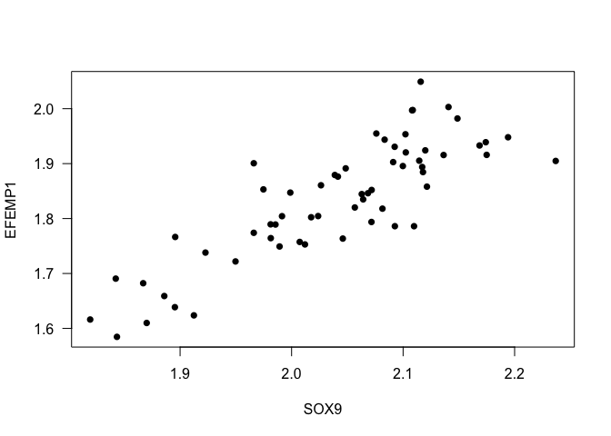<!-- -->


```r
cor(data$SOX9, data$EFEMP1)
```

```
## [1] 0.8451555
```


```r
cor(data$SOX9, data$EFEMP1, method = 's')
```

```
## [1] 0.8231095
```

**Interpretation**: The correlation of the expression between the genes SOX9 and EFEMP1 is `0.8451555`, it means that the gene expression of both genes increases at the same time.


* Example 2. How is the correlation between the expression values for GJA1 and DUSP4?


```r
cor(data$GJA1, data$DUSP4, method = "p")
```

```
## [1] -0.09835933
```


```r
cor(data$GJA1, data$DUSP4, method = "s")
```

```
## [1] -0.1555791
```


```r
plot(data$GJA1, data$DUSP4, 
     xlab = "GJA1",
     ylab = "DUSP4",
     las = 1,
     pch = 16)
```

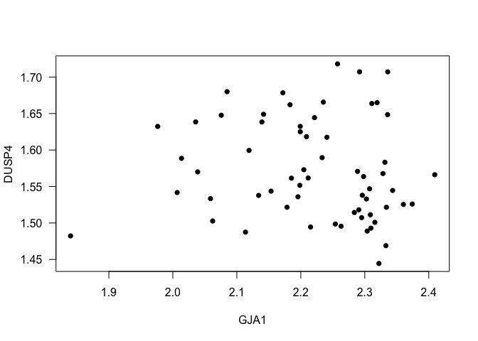<!-- -->


**Interpretation**: The Spearman correlation between the genes GJA1 and DUSP4 is `-0.1555791`, it means that the correlation is really small.

### Contingency tables
When we are interested in how two categorical variables are related to each other, we can use **Fisher's exact test** or **Chi-Squared test**. What will make you choose your test is basically the limitations. The Chi-Squared test is less conservative than the Fisher test.

Limitations for the Chi-Squared test usage:

* Big samples will always return significance, even when it doesn't exist;
* It's sensitive to small samples. If you have less than 20% in one cell or less than 5 samples, it's better to use a Fisher test.

Hypothesis:

* $H_0$: Variable A and Variable B are independent.
* $H_a$: Variable A and Variable B are not independent.

The functions `fisher.test()` and `chisq.test()` compute this tests on R.

* Example 1. Test if there an association of the Gender and having the disorder. Consider a confidence level of 95%.


```r
table(data$Gender, data$Status)
```

```
##         
##          Bipolar disorder Healthy control
##   Female               14               7
##   Male                 16              24
```


```r
table(data$Gender, data$Status) %>%
  fisher.test(.)
```

```
## 
## 	Fisher's Exact Test for Count Data
## 
## data:  .
## p-value = 0.062
## alternative hypothesis: true odds ratio is not equal to 1
## 95 percent confidence interval:
##   0.878418 10.712172
## sample estimates:
## odds ratio 
##   2.944493
```


```r
table(data$Gender, data$Status) %>%
  chisq.test(.)
```

```
## 
## 	Pearson's Chi-squared test with Yates' continuity correction
## 
## data:  .
## X-squared = 2.9237, df = 1, p-value = 0.08729
```


**Interpretation**: We don't have enough support to reject the null hypothesis, it means, we cannot reject the hypothesis that having Bipolar Disorder is a gender-related disorder.


### ANOVA
The ANOVA basically splits the variability in variability inside the groups and variability between groups and compares both. The bigger the variability between the groups, the bigger is the evidence that there is a difference between the groups, it means: They have different means!

**Remember! If we want to test means the variable must follow a Normal distribution!**

Hypothesis:

* $H_0$: The means are the same in all treatments.
* $H_a$: The means differ in at least one treatment.

To use ANOVA on R we can use the function `aov()` or `lm()`.

Example 1: Check if there is a difference in the gene expression of SOX9 depending on levels of alcohol abuse.


```r
data$Alcohol_abuse %<>% as.factor()


shapiro.test(data$SOX9)
```

```
## 
## 	Shapiro-Wilk normality test
## 
## data:  data$SOX9
## W = 0.96446, p-value = 0.07367
```


```r
# Yep! Let's do the anova now.
fit1 <- aov(data$SOX9 ~ data$Alcohol_abuse)
fit1
```

```
## Call:
##    aov(formula = data$SOX9 ~ data$Alcohol_abuse)
## 
## Terms:
##                 data$Alcohol_abuse Residuals
## Sum of Squares           0.0107959 0.5215027
## Deg. of Freedom                  5        54
## 
## Residual standard error: 0.09827236
## Estimated effects may be unbalanced
## 1 observation deleted due to missingness
```


```r
# Let's check the results
summary(fit1)
```

```
##                    Df Sum Sq  Mean Sq F value Pr(>F)
## data$Alcohol_abuse  5 0.0108 0.002159   0.224  0.951
## Residuals          54 0.5215 0.009657               
## 1 observation deleted due to missingness
```


```r
# A way to see if it makes sense is to plot the boxplot for each level.
boxplot(data$SOX9 ~ data$Alcohol_abuse, 
        xlab = "Alcohol abuse", 
        ylab = "SOX9", las = 1, 
        col = rainbow(6, s = 0.4, alpha = 0.5))
```

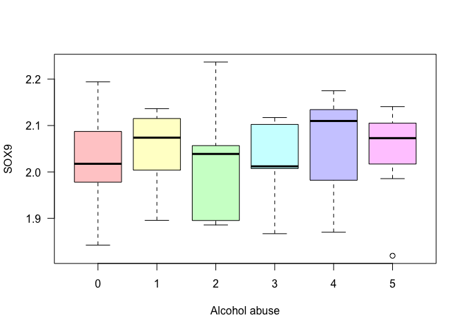<!-- -->


#### Diagnostic Plots
**We have to check if our model is well adjusted to our data.**

* Basically:

* Residuals should be randomly distributed around 0.
* The residuals should follow a Normal distribution.
* Cook's distance should be smaller than 10. (Indicates outliers)
* Who has to adapt to the data is the model, never the opposite


```r
layout(matrix(c(1,2,3,4),2,2)) # optional layout
plot(fit1, pch = 16, las = 1) # diagnostic plots
```

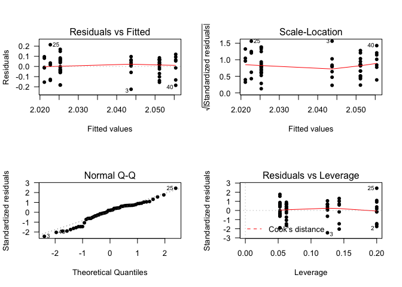<!-- -->


1. What is the hypothesis?
* $H_0: \mu_{alchool = 0} = \mu_{alchool = 1} = ... = \mu_{alchool = 5}$
* $H_a: \mu_{alchool = 0} \neq \mu_{alchool = 1} \neq ... \neq \mu_{alchool = 5}$
1. What is the statistics?
* Mean
2. What is the significance level?
* 0.05
3. Results?
* p-value > 0.05
**Interpretation**: The p-value is greater than 0.05, so we have no support to reject the null hypothesis and say that there is an association between Alcohol abuse and the expression levels of SOX9.


#### Multiple Comparisons (Post Hoc tests)
In the case where at least one mean differs from the other(s), How do we know which mean is different?

One option is to use the **Tukey's Method** to test all possible pairwise differences of means to determine if at least one difference is significantly different from 0;
On R the function is ``TukeyHSD(aov())``.

Another option is **Scheffe's Method** to test all possible contrasts at the same time, to see if at least one is significantly different from 0;
On R, ``scheffe.test(aov, "treatment")``.

Another option is **Duncan**. It is much more conservative, and more powerful than the other, but it doesn't control the error rate correctly;
On R, ``duncan.test(aov, "treatment")``.


```r
# Tukey Honestly Significant Differences
TukeyHSD(fit1)
```

```
##   Tukey multiple comparisons of means
##     95% family-wise confidence level
## 
## Fit: aov(formula = data$SOX9 ~ data$Alcohol_abuse)
## 
## $`data$Alcohol_abuse`
##             diff         lwr       upr     p adj
## 1-0  0.025853063 -0.07266358 0.1243697 0.9705417
## 2-0 -0.002588266 -0.14852217 0.1433456 0.9999999
## 3-0 -0.004145659 -0.15007957 0.1417882 0.9999994
## 4-0  0.030100128 -0.09827274 0.1584730 0.9820127
## 5-0  0.018463549 -0.10390575 0.1408328 0.9976591
## 2-1 -0.028441329 -0.17719820 0.1203155 0.9928779
## 3-1 -0.029998722 -0.17875560 0.1187582 0.9908963
## 4-1  0.004247066 -0.12732609 0.1358202 0.9999988
## 5-1 -0.007389514 -0.13311202 0.1183330 0.9999768
## 3-2 -0.001557393 -0.18518686 0.1820721 1.0000000
## 4-2  0.032688394 -0.13731946 0.2026962 0.9926896
## 5-2  0.021051815 -0.14446955 0.1865732 0.9989690
## 4-3  0.034245788 -0.13576207 0.2042536 0.9909430
## 5-3  0.022609208 -0.14291216 0.1881306 0.9985458
## 5-4 -0.011636580 -0.16190371 0.1386306 0.9999090
```


```r
plot(TukeyHSD(fit1), las=1)
```

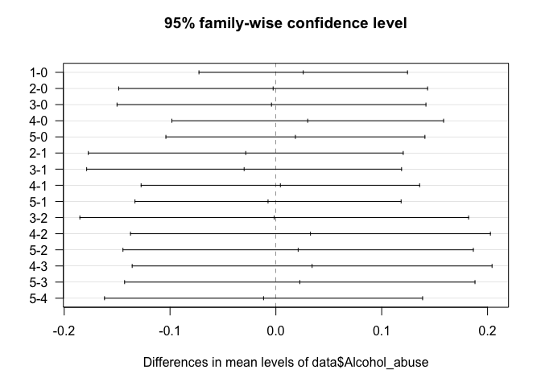<!-- -->


### Non-parametric ANOVA
#### Kruskal Wallis

It is a one-way ANOVA, an extension of the Mann-Whitney test. It is used for **independent samples**.

To use this test in R we can use the function ``kruskal.test()``.

Example: Test if the levels of the gene expression of the gene SST is different among different Alcohol abuse levels.


```r
shapiro.test(data$SST)
```

```
## 
## 	Shapiro-Wilk normality test
## 
## data:  data$SST
## W = 0.90416, p-value = 0.0001656
```


```r
kruskal.test(data$SST~data$Alcohol_abuse)
```

```
## 
## 	Kruskal-Wallis rank sum test
## 
## data:  data$SST by data$Alcohol_abuse
## Kruskal-Wallis chi-squared = 4.2373, df = 5, p-value = 0.5158
```


```r
boxplot(data$SST~data$Alcohol_abuse, las = 1, pch = 4, 
        col = rainbow(6, s = 0.4, alpha = 0.5),
        ylab = "SST", xlab = "Alcohol abuse")
```

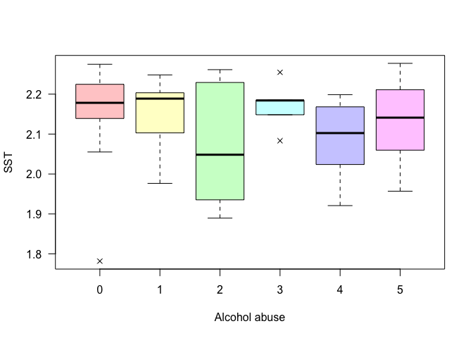<!-- -->


#### Friedman
It is a one-way ANOVA, an extension of the Wilcoxon test. It is used for **dependent samples**. You must have complete cases, it means, all groups have to have the same size.
To use this test in R we can use the function ``friedman.test()``.


### Regression Models
#### Linear Regression
Linear regression is an approach for modelling the linear relationship between a response variable Y and one or more explanatory variables (or independent variables) denoted by X.

There are a lot of assumptions to use this methodology:

* We assume that the response variable is error free (has no measurement error);
* We assume that the explanatory we use are independents - multicolinerarity;
* We assume that the variance is constant;
* We assume that the errors are independent;
* This is the mathematical expression of a regression model: $Y = \beta_{0} + \beta_{1}\times{X_1 }+ ... + \beta_{j}\times{X_j} + \epsilon$

**Interpretation**: A fitted linear regression model can be used to identify the relationship between a single explanatory variable $X_j$ and the response variable $Y$ when all the other explanatory variables in the model are "held fixed". Specifically, the interpretation of $\beta_j$ is the expected change in Y for a one-unit change in $X_j$ when the other covariates are held fixed.

If we are using the linear model, we assume that the response variable is normally distributed. If we have other distributions, we can use a general linear model that accounts for other models as the Gamma, the Beta, the Poisson etc.

In all of them, we should always pay attention to the residuals, that should follow a Normal distribution, and the way to check it is similar to the ANOVA.

On R we can use the function `glm()` for modelling, the family parameter gives you the kind of regression you are doing. When a normal distribution is assumed, the function `lm()` can be used.

**Important**: The way to interpret each kind of family changes. Some are in percentage, some are in odds ratio, some are linear. For that, you should find more information before using it.

* Example 1: Suppose we are interested in how much, on average, the gene expression of one gene alters with the time after death.


```r
cor(data$Post_morten_interval, data$CLDN10)
```

```
## [1] -0.3810924
```


```r
plot(data$Post_morten_interval, data$CLDN10, pch = 20, 
     xlab = 'Post morten interval', ylab = 'CLDN10')
```

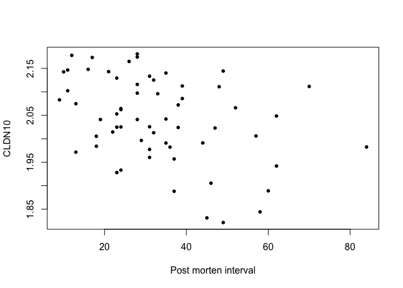<!-- -->


```r
shapiro.test(data$CLDN10)
```

```
## 
## 	Shapiro-Wilk normality test
## 
## data:  data$CLDN10
## W = 0.9634, p-value = 0.06516
```


```r
mod <- lm(data$CLDN10 ~ data$Post_morten_interval)
summary(mod)
```

```
## 
## Call:
## lm(formula = data$CLDN10 ~ data$Post_morten_interval)
## 
## Residuals:
##       Min        1Q    Median        3Q       Max 
## -0.185611 -0.053120  0.000983  0.065988  0.149693 
## 
## Coefficients:
##                            Estimate Std. Error t value Pr(>|t|)    
## (Intercept)                2.113098   0.025012  84.484  < 2e-16 ***
## data$Post_morten_interval -0.002162   0.000683  -3.166  0.00244 ** 
## ---
## Signif. codes:  0 '***' 0.001 '**' 0.01 '*' 0.05 '.' 0.1 ' ' 1
## 
## Residual standard error: 0.08416 on 59 degrees of freedom
## Multiple R-squared:  0.1452,	Adjusted R-squared:  0.1307 
## F-statistic: 10.02 on 1 and 59 DF,  p-value: 0.002445
```


```r
fit <- glm(data$CLDN10 ~ data$Post_morten_interval, family = "gaussian")
summary(fit)
```

```
## 
## Call:
## glm(formula = data$CLDN10 ~ data$Post_morten_interval, family = "gaussian")
## 
## Deviance Residuals: 
##       Min         1Q     Median         3Q        Max  
## -0.185611  -0.053120   0.000983   0.065988   0.149693  
## 
## Coefficients:
##                            Estimate Std. Error t value Pr(>|t|)    
## (Intercept)                2.113098   0.025012  84.484  < 2e-16 ***
## data$Post_morten_interval -0.002162   0.000683  -3.166  0.00244 ** 
## ---
## Signif. codes:  0 '***' 0.001 '**' 0.01 '*' 0.05 '.' 0.1 ' ' 1
## 
## (Dispersion parameter for gaussian family taken to be 0.007083715)
## 
##     Null deviance: 0.48895  on 60  degrees of freedom
## Residual deviance: 0.41794  on 59  degrees of freedom
## AIC: -124.87
## 
## Number of Fisher Scoring iterations: 2
```


After fitting a model we have to check its residuals.


```r
shapiro.test(fit$residuals)
```

```
## 
## 	Shapiro-Wilk normality test
## 
## data:  fit$residuals
## W = 0.97385, p-value = 0.2156
```


```r
par(mfrow = c(2,2))

plot(mod, which = c(1:4), add.smooth = FALSE, pch=20, las = 1)
```

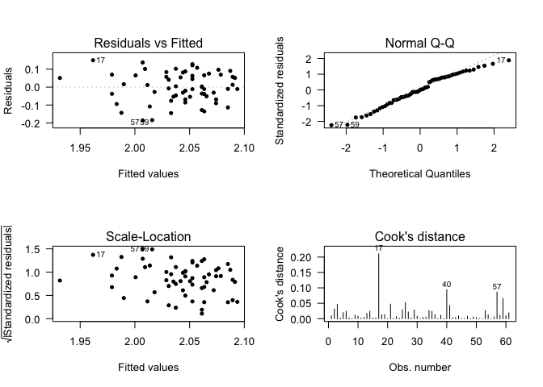<!-- -->


* $\beta_0$ - It is the value predicted for the null effect of the CLDN10 gene expression, in this case, this value is 2.11. It means that, on average, the mean expression of CLDN10 is 2.11, when the post-Morten interval is 0.
* $\beta_1$ - It is the diminution (negative value) in the predicted CLDN10 gene expression for the increase on 1 unity on the Post Morten Interval, In this case, the diminution predicted on the gene expression, is of -0.002 for each 1 unity increased on the post-Morten interval.

Question: Does it make sense that the gene expression decreases with the increase of the time?


### Summary
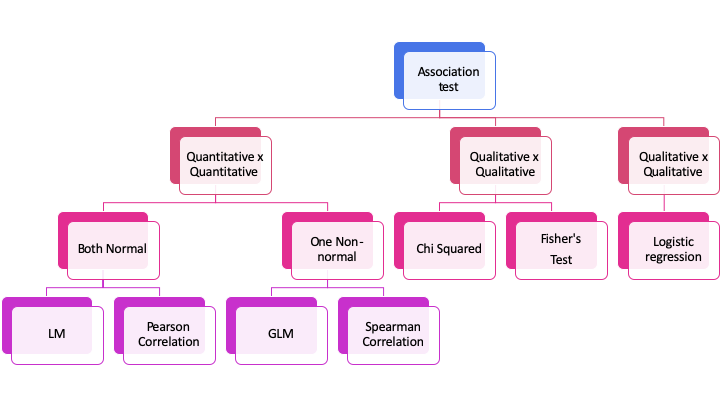

### Exercise {.tabset .tabset-fade .tabset-pills}
#### Exercises
1. Is there a correlation between the levels of APOLD1 and TAC1?
1. Test if there is an association of Suicide and Patients treated with lithium. And for patients treated with valproate?
1. Test if there is a difference on the gene expression of the genes CLDN10, EFEMP1, PLSCR4, SOX9 in cases and controls. And male and females? Consider a model with gender and disease status. 
Do not forget to make the diagnosis of the models. 


#### Results
1. Is there a correlation between the levels of APOLD1 and TAC1?


```r
plot(data$APOLD1, data$TAC1, pch = 16)
```

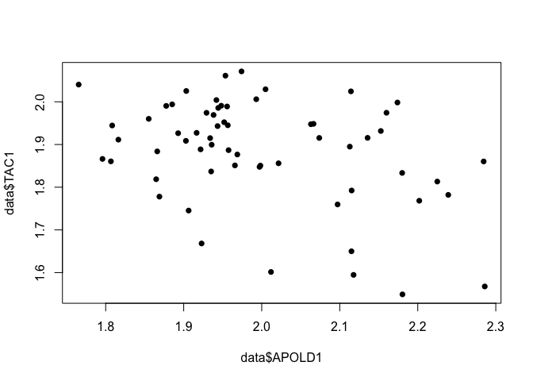<!-- -->

```r
hist(data$APOLD1)
```

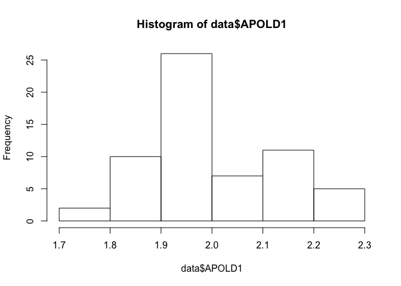<!-- -->

```r
shapiro.test(data$APOLD1)
```

```
## 
## 	Shapiro-Wilk normality test
## 
## data:  data$APOLD1
## W = 0.95296, p-value = 0.01999
```

```r
hist(data$TAC1)
```

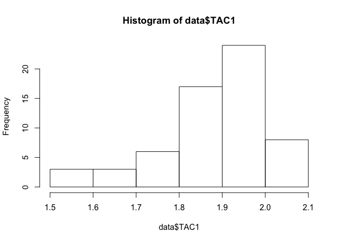<!-- -->

```r
shapiro.test(data$TAC1)
```

```
## 
## 	Shapiro-Wilk normality test
## 
## data:  data$TAC1
## W = 0.91607, p-value = 0.0004777
```

```r
cor(data$APOLD1, data$TAC1, method = "s")
```

```
## [1] -0.2717081
```
2. Test if there is an association of Suicide and Patients treated with lithium. And for patients treated with valproate?


```r
table(Bipolars$Suicide, Bipolars$Therapy_Lithium)
```

```
##      
##       No Yes
##   No  15   3
##   Yes  7   5
```

```r
table(Bipolars$Suicide, Bipolars$Therapy_Lithium) %>% chisq.test()
```

```
## Warning in chisq.test(.): Chi-squared approximation may be incorrect
```

```
## 
## 	Pearson's Chi-squared test with Yates' continuity correction
## 
## data:  .
## X-squared = 1.2003, df = 1, p-value = 0.2733
```

```r
table(Bipolars$Suicide, Bipolars$Therapy_Valproate)
```

```
##      
##       No Yes
##   No  11   7
##   Yes  9   3
```

```r
table(Bipolars$Suicide, Bipolars$Therapy_Valproate) %>% chisq.test()
```

```
## Warning in chisq.test(.): Chi-squared approximation may be incorrect
```

```
## 
## 	Pearson's Chi-squared test with Yates' continuity correction
## 
## data:  .
## X-squared = 0.15625, df = 1, p-value = 0.6926
```


3. Test if there is a difference on the gene expression of the genes CLDN10, EFEMP1, PLSCR4, SOX9 in cases and controls. And male and females? Consider a model with gender and disease status. 
Do not forget to make the diagnosis of the models. 


```r
shapiro.test(data$CLDN10)
```

```
## 
## 	Shapiro-Wilk normality test
## 
## data:  data$CLDN10
## W = 0.9634, p-value = 0.06516
```

```r
shapiro.test(data$EFEMP1)
```

```
## 
## 	Shapiro-Wilk normality test
## 
## data:  data$EFEMP1
## W = 0.97247, p-value = 0.1846
```

```r
shapiro.test(data$PLSCR4)
```

```
## 
## 	Shapiro-Wilk normality test
## 
## data:  data$PLSCR4
## W = 0.96814, p-value = 0.1125
```

```r
shapiro.test(data$SOX9)
```

```
## 
## 	Shapiro-Wilk normality test
## 
## data:  data$SOX9
## W = 0.96446, p-value = 0.07367
```

```r
CLD_SEX = lm(data$CLDN10 ~ data$Gender)
summary(CLD_SEX)
```

```
## 
## Call:
## lm(formula = data$CLDN10 ~ data$Gender)
## 
## Residuals:
##       Min        1Q    Median        3Q       Max 
## -0.217136 -0.054595  0.001301  0.072758  0.139083 
## 
## Coefficients:
##                  Estimate Std. Error t value Pr(>|t|)    
## (Intercept)      2.047284   0.019845 103.166   <2e-16 ***
## data$GenderMale -0.008617   0.024506  -0.352    0.726    
## ---
## Signif. codes:  0 '***' 0.001 '**' 0.01 '*' 0.05 '.' 0.1 ' ' 1
## 
## Residual standard error: 0.09094 on 59 degrees of freedom
## Multiple R-squared:  0.002091,	Adjusted R-squared:  -0.01482 
## F-statistic: 0.1236 on 1 and 59 DF,  p-value: 0.7264
```

```r
par(mfrow = c(2,2))
plot(CLD_SEX, which = c(1:4), add.smooth = FALSE, pch=20, las = 1)
```

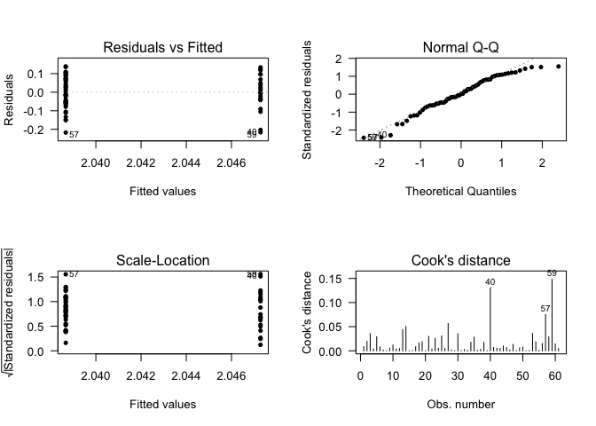<!-- -->

```r
CLD_STATUS = lm(data$CLDN10 ~ data$Status)
summary(CLD_STATUS)
```

```
## 
## Call:
## lm(formula = data$CLDN10 ~ data$Status)
## 
## Residuals:
##       Min        1Q    Median        3Q       Max 
## -0.200394 -0.056033  0.002142  0.075311  0.124555 
## 
## Coefficients:
##                            Estimate Std. Error t value Pr(>|t|)    
## (Intercept)                 2.06200    0.01620 127.291   <2e-16 ***
## data$StatusHealthy control -0.04007    0.02272  -1.763    0.083 .  
## ---
## Signif. codes:  0 '***' 0.001 '**' 0.01 '*' 0.05 '.' 0.1 ' ' 1
## 
## Residual standard error: 0.08873 on 59 degrees of freedom
## Multiple R-squared:  0.05007,	Adjusted R-squared:  0.03397 
## F-statistic:  3.11 on 1 and 59 DF,  p-value: 0.083
```

```r
par(mfrow = c(2,2))
plot(CLD_STATUS, which = c(1:4), add.smooth = FALSE, pch=20, las = 1)
```

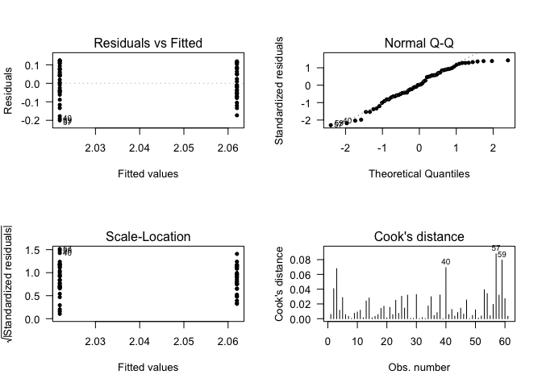<!-- -->

```r
CLD_SS = lm(data$CLDN10 ~ data$Status + data$Gender)
summary(CLD_SS)
```

```
## 
## Call:
## lm(formula = data$CLDN10 ~ data$Status + data$Gender)
## 
## Residuals:
##       Min        1Q    Median        3Q       Max 
## -0.200894 -0.054854  0.001643  0.075772  0.124055 
## 
## Coefficients:
##                             Estimate Std. Error t value Pr(>|t|)    
## (Intercept)                 2.060819   0.021063  97.841   <2e-16 ***
## data$StatusHealthy control -0.040605   0.023690  -1.714   0.0919 .  
## data$GenderMale             0.002211   0.024927   0.089   0.9296    
## ---
## Signif. codes:  0 '***' 0.001 '**' 0.01 '*' 0.05 '.' 0.1 ' ' 1
## 
## Residual standard error: 0.08948 on 58 degrees of freedom
## Multiple R-squared:  0.0502,	Adjusted R-squared:  0.01745 
## F-statistic: 1.533 on 2 and 58 DF,  p-value: 0.2246
```

```r
par(mfrow = c(2,2))
plot(CLD_SS, which = c(1:4), add.smooth = FALSE, pch=20, las = 1)
```

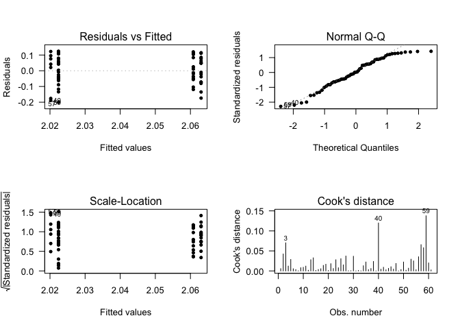<!-- -->

```r
EFE_SEX = lm(data$EFEMP1 ~ data$Gender)
summary(EFE_SEX)
```

```
## 
## Call:
## lm(formula = data$EFEMP1 ~ data$Gender)
## 
## Residuals:
##      Min       1Q   Median       3Q      Max 
## -0.25679 -0.06492  0.01167  0.07423  0.21773 
## 
## Coefficients:
##                 Estimate Std. Error t value Pr(>|t|)    
## (Intercept)      1.84142    0.02359  78.046   <2e-16 ***
## data$GenderMale -0.01003    0.02914  -0.344    0.732    
## ---
## Signif. codes:  0 '***' 0.001 '**' 0.01 '*' 0.05 '.' 0.1 ' ' 1
## 
## Residual standard error: 0.1081 on 59 degrees of freedom
## Multiple R-squared:  0.002004,	Adjusted R-squared:  -0.01491 
## F-statistic: 0.1184 on 1 and 59 DF,  p-value: 0.7319
```

```r
par(mfrow = c(2,2))
plot(EFE_SEX, which = c(1:4), add.smooth = FALSE, pch=20, las = 1)
```

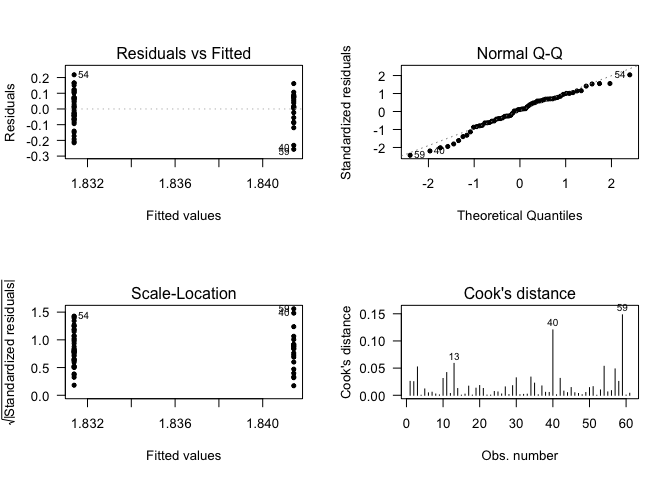<!-- -->

```r
EFE_STATUS = lm(data$EFEMP1 ~ data$Status)
summary(EFE_STATUS)
```

```
## 
## Call:
## lm(formula = data$EFEMP1 ~ data$Status)
## 
## Residuals:
##       Min        1Q    Median        3Q       Max 
## -0.237010 -0.059673 -0.000089  0.078471  0.232019 
## 
## Coefficients:
##                            Estimate Std. Error t value Pr(>|t|)    
## (Intercept)                 1.85318    0.01947  95.161   <2e-16 ***
## data$StatusHealthy control -0.03608    0.02732  -1.321    0.192    
## ---
## Signif. codes:  0 '***' 0.001 '**' 0.01 '*' 0.05 '.' 0.1 ' ' 1
## 
## Residual standard error: 0.1067 on 59 degrees of freedom
## Multiple R-squared:  0.02872,	Adjusted R-squared:  0.01225 
## F-statistic: 1.744 on 1 and 59 DF,  p-value: 0.1917
```

```r
par(mfrow = c(2,2))
plot(EFE_STATUS, which = c(1:4), add.smooth = FALSE, pch=20, las = 1)
```

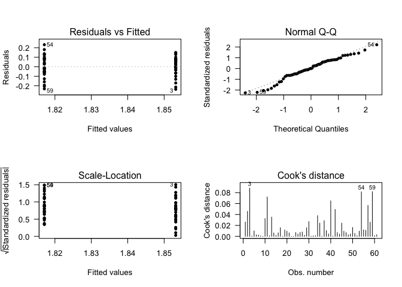<!-- -->

```r
EFE_SS = lm(data$EFEMP1 ~ data$Status + data$Gender)
summary(EFE_SS)
```

```
## 
## Call:
## lm(formula = data$EFEMP1 ~ data$Status + data$Gender)
## 
## Residuals:
##      Min       1Q   Median       3Q      Max 
## -0.23681 -0.06001 -0.00032  0.07857  0.23212 
## 
## Coefficients:
##                              Estimate Std. Error t value Pr(>|t|)    
## (Intercept)                 1.8534086  0.0253228  73.191   <2e-16 ***
## data$StatusHealthy control -0.0359745  0.0284818  -1.263    0.212    
## data$GenderMale            -0.0004343  0.0299688  -0.014    0.988    
## ---
## Signif. codes:  0 '***' 0.001 '**' 0.01 '*' 0.05 '.' 0.1 ' ' 1
## 
## Residual standard error: 0.1076 on 58 degrees of freedom
## Multiple R-squared:  0.02872,	Adjusted R-squared:  -0.004773 
## F-statistic: 0.8575 on 2 and 58 DF,  p-value: 0.4295
```

```r
par(mfrow = c(2,2))
plot(EFE_SS, which = c(1:4), add.smooth = FALSE, pch=20, las = 1)
```

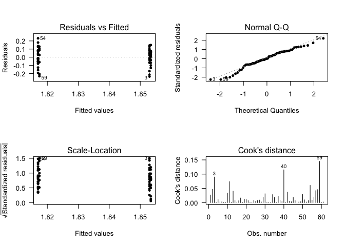<!-- -->

