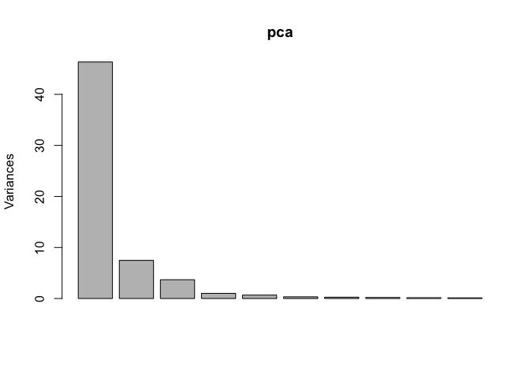
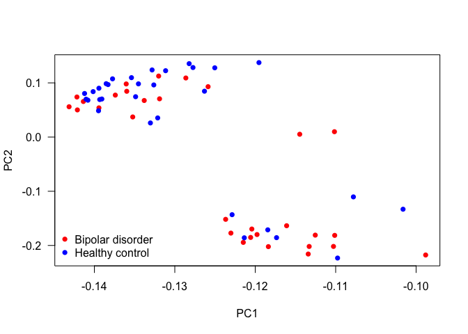
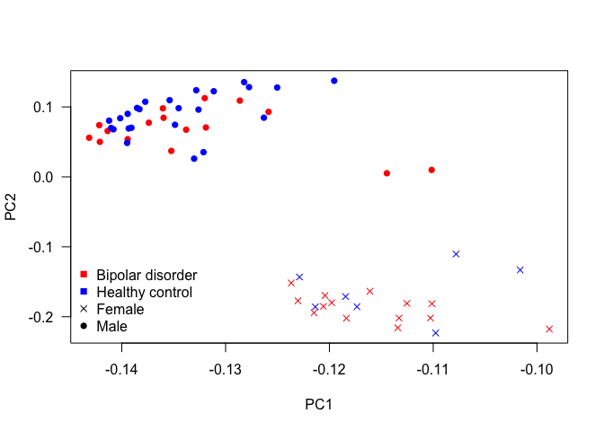
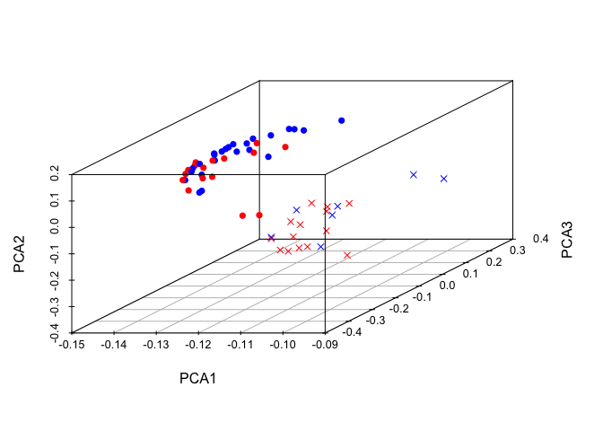

# Multivariate Analysis
{: .no_toc }


## Table of contents
{: .no_toc .text-delta }

1. TOC
{:toc}

---
## Multivariated Analysis
The multivariate analysis aims to reduce the dimensionality of datasets with more than one response variable.

### Principal Component Analysis (PCA)
Principal component analysis (PCA) is a statistical procedure that transforms a set of possibly correlated variables into a set of values of linearly uncorrelated variables, the principal components (PC). The number of PC is less or equal to the number of variables. The first PC has the largest variance and it decreases.

PCA is sensitive to the scale of variables. So it needs to normalize the data before running it.

The PCA can be called on R using the functions: `prcomp()` and `princomp()`.

* Example. Using only the genes in our dataset, let's see if there is any cluster. Later, plot it and colour by gender and disorder.


```r
pca = prcomp(t(data[,-c(1:16)]), scale. = T, center = T)
plot(pca)
```

<!-- -->


```r
plot(pca$rotation, col = c('red', 'blue')[unclass(as.factor(data$Status))], pch = 16, las = 1)
legend('bottomleft', 
       levels(as.factor(data$Status)), 
       col = c('red', 'blue'), 
       pch = 16, 
       bty = 'n')
```

<!-- -->


```r
plot(pca$rotation, col = c('red', 'blue')[unclass(as.factor(data$Status))], pch = c(4, 16)[unclass(as.factor(data$Gender))], las = 1)

legend('bottomleft', 
       c(levels(as.factor(data$Status)), levels(as.factor(data$Gender))), 
       col = c('red', 'blue', 'black', 'black'), 
       pch = c(15,15,4,16), 
       bty = 'n')
```

<!-- -->


```r
require(scatterplot3d)
```

```
## Loading required package: scatterplot3d
```


```r
scatterplot3d::scatterplot3d(pca$rotation[,1], 
                             pca$rotation[,3],
                             pca$rotation[,2],
                             xlab = 'PCA1', 
                             ylab = 'PCA3', 
                             zlab = 'PCA2', 
                             las = 1, 
                             color = c('red', 'blue')[unclass(as.factor(data$Status))], 
                             pch = c(4, 16)[unclass(as.factor(data$Gender))] )
```

<!-- -->
