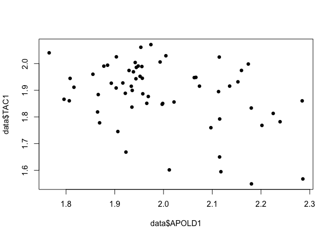
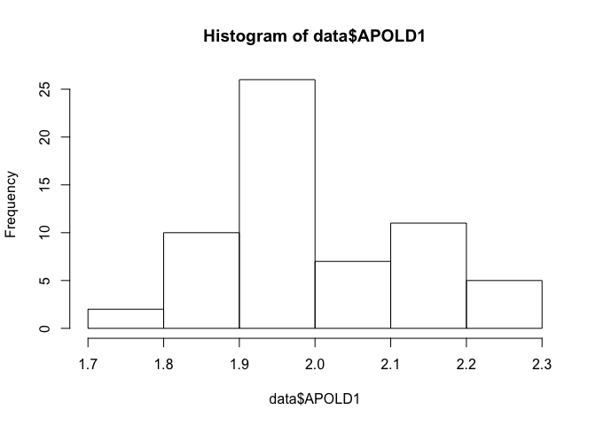
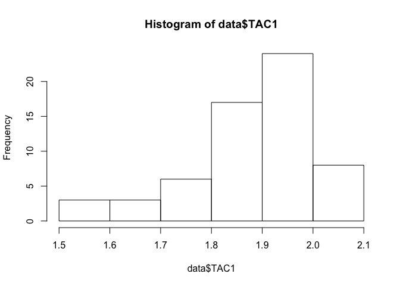
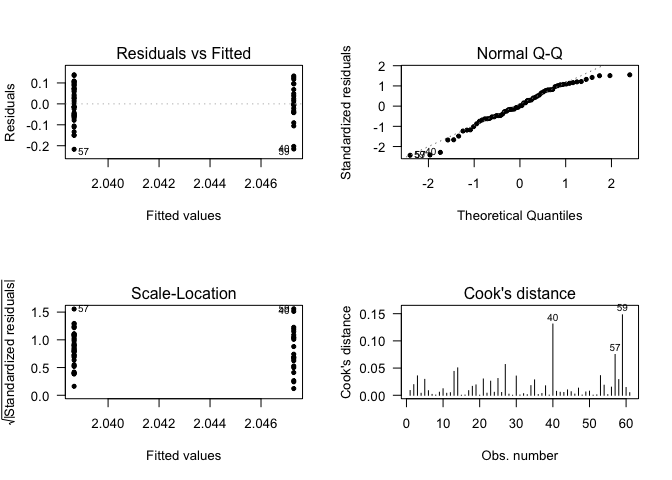

# Results
{: .no_toc }

## Table of contents
{: .no_toc .text-delta }

1. TOC
{:toc}

---
 
## Introduction
1. Define the type of each variable in our data set.


```r
str(data)
```

* Qualitative Nominal:
* X
* Status Disease
* Therapy (Eletroconvulcive, Valproate, Lithium)
* Qualitative Ordinal 
* Alchool abuse
* Drug abuse
* Quantative Discrete:
* Age (death and onset)
* Duration disease
* Therapy Fluphenazine
* Quantative Continuous:
* pH
* Genes

## Descriptive Statistics

1. Make absolute and relative frequency tables for the variables: Gender and Status. 


```r
table(data$Gender, data$Status)
```

```
##         
##          Bipolar disorder Healthy control
##   Female               14               7
##   Male                 16              24
```

```r
table(data$Gender, data$Status) %>%
  prop.table() %>% 
  round(., digits = 4) * 100
```

```
##         
##          Bipolar disorder Healthy control
##   Female            22.95           11.48
##   Male              26.23           39.34
```


2. Check how many people that suffered from Bipolar Disorder committed suicide. Visualise it using a barplot. 


```r
table(data$Suicide, data$Status)
```

```
##      
##       Bipolar disorder Healthy control
##   No                18              31
##   Yes               12               0
```

```r
table(data$Suicide, data$Status) %>% 
  barplot(., beside = TRUE, 
          las = 1, 
          legend.text = TRUE)
```

<!-- -->

3. Compute and make the correct interpretations for the mean, median, IQR, standard deviation, variance and CV for **all the quantitative variables**. Tipp: You can create a function for that!


```r
# Create a basic function
mySummary <- function(myVar){
  
  myMean = mean(myVar, na.rm = T)
  myMedian = median(myVar, na.rm = T)
  myIQR = IQR(myVar, na.rm = T)
  mySd = sd(myVar, na.rm = T)
  myVar = var(myVar, na.rm = T)
  myCV = mySd/myMean * 100
  
  Output = cbind(myMean, myMedian, myIQR, mySd, myVar, myCV)
  return(Output)
}

Quantitative = data[,c(2:3,5,8,10,13,17:47)]
Result = apply(Quantitative,2,mySummary)
```


4. Compute and make the correct interpretations for the mean, median, IQR, standard deviation, variance and CV for all the numeric variables **only for Males**. Tipp: Use the function created before on a subset of the dataset.


```r
Quantitative = data[,c(2:3,5,8,10,13,17:47)]
Result_Male = subset(Quantitative, data$Gender == "Male") %>%
  apply(.,2,mySummary)
```


5. Compute and make the correct interpretations for the mean, median, IQR, standard deviation, variance and CV for all the quantitative variables for **both conditions separately**. Tipp: Use the function created before; use the function `by()`.


```r
Quantitative = data[,c(2:3,5,8,10,13,17:47)] %>% as.data.frame()
Out = list()
for(i in 1: ncol(Quantitative)){
  myvector = Quantitative[,i] %>% as.numeric()
  Out_tmp=  by(myvector, data$Status, mySummary, simplify = T)
  Out_tmp %<>% unlist %>% matrix(., nrow = 2, byrow = T) %>% as.data.frame()
  names(Out_tmp) = c("mean", "median", "IQR", "sd", "Var", "CV")
  rownames(Out_tmp) = c("Bipolar disorder", "Healthy control")
  rownames(Out_tmp) = paste(names(Quantitative)[i], row.names(Out_tmp), sep = "_")
  
  Out_tmp$Var = rownames(Out_tmp)
  Out[[i]] = Out_tmp
}

Final = data.table::rbindlist(Out)

head(Final)
```

```
##         mean median   IQR         sd                        Var        CV
## 1: 44.533333 44.000  9.75 10.7084669 Age_death_Bipolar disorder 24.045959
## 2: 43.838710 45.000 10.50  7.3261940  Age_death_Healthy control 16.711701
## 3: 24.033333 22.000  9.50  7.9110718 Age_onset_Bipolar disorder 32.917081
## 4:       NaN     NA    NA         NA  Age_onset_Healthy control        NA
## 5:  6.475000  6.505  0.31  0.2743236  Brain_ph_Bipolar disorder  4.236658
## 6:  6.628387  6.700  0.31  0.2663844   Brain_ph_Healthy control  4.018842
```


## Hypothesis Testing

1. Test if the proportion of therapies differs on the patients.

```r
Bipolars = subset(data, data$Status =="Bipolar disorder")
table(Bipolars$Therapy_Lithium) %>% prop.test()
```

```
## 
## 	1-sample proportions test with continuity correction
## 
## data:  ., null probability 0.5
## X-squared = 5.6333, df = 1, p-value = 0.01762
## alternative hypothesis: true p is not equal to 0.5
## 95 percent confidence interval:
##  0.5382722 0.8702456
## sample estimates:
##         p 
## 0.7333333
```

```r
table(Bipolars$Therapy_Valproate) %>% prop.test()
```

```
## 
## 	1-sample proportions test with continuity correction
## 
## data:  ., null probability 0.5
## X-squared = 2.7, df = 1, p-value = 0.1003
## alternative hypothesis: true p is not equal to 0.5
## 95 percent confidence interval:
##  0.4713741 0.8206242
## sample estimates:
##         p 
## 0.6666667
```

```r
table(Bipolars$Therapy_Electroconvulsive) %>% prop.test()
```

```
## 
## 	1-sample proportions test with continuity correction
## 
## data:  ., null probability 0.5
## X-squared = 20.833, df = 1, p-value = 5.01e-06
## alternative hypothesis: true p is not equal to 0.5
## 95 percent confidence interval:
##  0.7649271 0.9883682
## sample estimates:
##         p 
## 0.9333333
```

2. Test if there is a difference on the (average or median) of brain pH and the status. And the brain side?

```r
data$Brain_ph %>% shapiro.test()
```

```
## 
## 	Shapiro-Wilk normality test
## 
## data:  .
## W = 0.94384, p-value = 0.007419
```

```r
wilcox.test(data$Brain_ph ~ data$Status)
```

```
## Warning in wilcox.test.default(x = c(6.6, 6.67, 6.7, 6.03, 6.35, 6.39, 6.51, :
## cannot compute exact p-value with ties
```

```
## 
## 	Wilcoxon rank sum test with continuity correction
## 
## data:  data$Brain_ph by data$Status
## W = 303.5, p-value = 0.0201
## alternative hypothesis: true location shift is not equal to 0
```

```r
boxplot(data$Brain_ph ~ data$Status, las = 1)
```

<!-- -->

```r
data$Brain_ph %>% shapiro.test()
```

```
## 
## 	Shapiro-Wilk normality test
## 
## data:  .
## W = 0.94384, p-value = 0.007419
```

```r
wilcox.test(data$Brain_ph ~ data$Side_brain)
```

```
## Warning in wilcox.test.default(x = c(6.6, 6.7, 6.03, 6.39, 6.51, 6.5, 6.5, :
## cannot compute exact p-value with ties
```

```
## 
## 	Wilcoxon rank sum test with continuity correction
## 
## data:  data$Brain_ph by data$Side_brain
## W = 554, p-value = 0.1958
## alternative hypothesis: true location shift is not equal to 0
```

```r
boxplot(data$Brain_ph ~ data$Side_brain, las = 1)
```

<!-- -->

3. Test if the average expression of the genes differs by gender.

```r
Genes = data[,17:ncol(data)]

myTest = function(myGene, myPhenotype){
  myPhenotype %<>% as.factor()
  myShap = myGene %>% shapiro.test()
  if(myShap$p.value > 0.05){
    myVar = var.test( myGene ~ myPhenotype)
    if(myVar$p.value > 0.05){
      myT = t.test(myGene ~ myPhenotype, var.equal = TRUE)
      p = myT$p.value
    }else if(myVar$p.value <= 0.05){
      myT = t.test(myGene ~ myPhenotype, var.equal = FALSE)
      p = myT$p.value
    }
  }
  else if(myShap$p.value <= 0.05){
    myT = wilcox.test(myGene ~ myPhenotype, paired = FALSE)
    p = myT$p.value
  }
  return(p)
}

myTest(Genes$APOLD1, myPhenotype = data$Gender)
```

```
## [1] 0.5317872
```

```r
apply(Genes, 2, myTest, myPhenotype = data$Gender)
```

```
## Warning in wilcox.test.default(x = c(1.9942942989882, 2.05780061866762, : cannot
## compute exact p-value with ties
```

```
##       APOLD1       CLDN10        DUSP4       EFEMP1       ETNPPL         GJA1 
## 5.317872e-01 7.263770e-01 8.863005e-01 7.319499e-01 1.757284e-01 4.555675e-01 
##       PLSCR4         SDC4      SLC14A1         SOX9          SST         TAC1 
## 2.678053e-01 1.348642e-01 3.858123e-01 2.524807e-01 1.397442e-02 5.619215e-01 
##       CX3CR1        DDX3Y     ETNPPL.1        G3BP2       GABRG2        KDM5D 
## 7.077235e-01 1.642534e-16 1.757284e-01 6.830784e-01 9.819888e-01 1.642534e-16 
##         MAFB         NBEA         OXR1         PAK1        PCDH8         PPID 
## 1.806556e-01 2.416237e-01 5.824513e-01 5.317872e-01 2.416237e-01 3.775685e-01 
##        PVALB       RPS4Y1        SST.1       TAC1.1      TBL1XR1        USP9Y 
## 7.186072e-02 1.642534e-16 1.397442e-02 5.619215e-01 8.735223e-01 1.642534e-16 
##         XIST 
## 1.642534e-16
```

4. Test if the average expression of the genes differs is different in the controls.

```r
apply(Genes, 2, myTest, myPhenotype = data$Status)
```

```
## Warning in wilcox.test.default(x = c(2.1213099124647, 1.85484903769606, : cannot
## compute exact p-value with ties
```

```
##       APOLD1       CLDN10        DUSP4       EFEMP1       ETNPPL         GJA1 
## 4.516246e-02 8.299889e-02 6.219081e-03 1.916905e-01 5.012671e-02 1.694804e-01 
##       PLSCR4         SDC4      SLC14A1         SOX9          SST         TAC1 
## 1.363228e-01 4.284287e-03 2.919839e-02 2.565146e-02 1.789292e-05 1.561385e-04 
##       CX3CR1        DDX3Y     ETNPPL.1        G3BP2       GABRG2        KDM5D 
## 3.469183e-02 4.516246e-02 5.012671e-02 2.664651e-03 1.982317e-02 1.080894e-01 
##         MAFB         NBEA         OXR1         PAK1        PCDH8         PPID 
## 7.134286e-03 3.688796e-03 8.538568e-03 5.187831e-02 2.014827e-03 2.759478e-04 
##        PVALB       RPS4Y1        SST.1       TAC1.1      TBL1XR1        USP9Y 
## 4.694746e-03 2.246033e-01 1.789292e-05 1.561385e-04 9.682067e-03 2.062640e-02 
##         XIST 
## 1.554616e-02
```


## Association
1. Is there a correlation between the levels of APOLD1 and TAC1?


```r
plot(data$APOLD1, data$TAC1, pch = 16)
```

<!-- -->

```r
hist(data$APOLD1)
```

<!-- -->

```r
shapiro.test(data$APOLD1)
```

```
## 
## 	Shapiro-Wilk normality test
## 
## data:  data$APOLD1
## W = 0.95296, p-value = 0.01999
```

```r
hist(data$TAC1)
```

<!-- -->

```r
shapiro.test(data$TAC1)
```

```
## 
## 	Shapiro-Wilk normality test
## 
## data:  data$TAC1
## W = 0.91607, p-value = 0.0004777
```

```r
cor(data$APOLD1, data$TAC1, method = "s")
```

```
## [1] -0.2717081
```
2. Test if there is an association of Suicide and Patients treated with lithium. And for patients treated with valproate?


```r
table(Bipolars$Suicide, Bipolars$Therapy_Lithium)
```

```
##      
##       No Yes
##   No  15   3
##   Yes  7   5
```

```r
table(Bipolars$Suicide, Bipolars$Therapy_Lithium) %>% chisq.test()
```

```
## Warning in chisq.test(.): Chi-squared approximation may be incorrect
```

```
## 
## 	Pearson's Chi-squared test with Yates' continuity correction
## 
## data:  .
## X-squared = 1.2003, df = 1, p-value = 0.2733
```

```r
table(Bipolars$Suicide, Bipolars$Therapy_Valproate)
```

```
##      
##       No Yes
##   No  11   7
##   Yes  9   3
```

```r
table(Bipolars$Suicide, Bipolars$Therapy_Valproate) %>% chisq.test()
```

```
## Warning in chisq.test(.): Chi-squared approximation may be incorrect
```

```
## 
## 	Pearson's Chi-squared test with Yates' continuity correction
## 
## data:  .
## X-squared = 0.15625, df = 1, p-value = 0.6926
```


3. Test if there is a difference on the gene expression of the genes CLDN10, EFEMP1, PLSCR4, SOX9 in cases and controls. And male and females? Consider a model with gender and disease status. 
Do not forget to make the diagnosis of the models. 


```r
shapiro.test(data$CLDN10)
```

```
## 
## 	Shapiro-Wilk normality test
## 
## data:  data$CLDN10
## W = 0.9634, p-value = 0.06516
```

```r
shapiro.test(data$EFEMP1)
```

```
## 
## 	Shapiro-Wilk normality test
## 
## data:  data$EFEMP1
## W = 0.97247, p-value = 0.1846
```

```r
shapiro.test(data$PLSCR4)
```

```
## 
## 	Shapiro-Wilk normality test
## 
## data:  data$PLSCR4
## W = 0.96814, p-value = 0.1125
```

```r
shapiro.test(data$SOX9)
```

```
## 
## 	Shapiro-Wilk normality test
## 
## data:  data$SOX9
## W = 0.96446, p-value = 0.07367
```

```r
CLD_SEX = lm(data$CLDN10 ~ data$Gender)
summary(CLD_SEX)
```

```
## 
## Call:
## lm(formula = data$CLDN10 ~ data$Gender)
## 
## Residuals:
##       Min        1Q    Median        3Q       Max 
## -0.217136 -0.054595  0.001301  0.072758  0.139083 
## 
## Coefficients:
##                  Estimate Std. Error t value Pr(>|t|)    
## (Intercept)      2.047284   0.019845 103.166   <2e-16 ***
## data$GenderMale -0.008617   0.024506  -0.352    0.726    
## ---
## Signif. codes:  0 '***' 0.001 '**' 0.01 '*' 0.05 '.' 0.1 ' ' 1
## 
## Residual standard error: 0.09094 on 59 degrees of freedom
## Multiple R-squared:  0.002091,	Adjusted R-squared:  -0.01482 
## F-statistic: 0.1236 on 1 and 59 DF,  p-value: 0.7264
```

```r
par(mfrow = c(2,2))
plot(CLD_SEX, which = c(1:4), add.smooth = FALSE, pch=20, las = 1)
```

<!-- -->

```r
CLD_STATUS = lm(data$CLDN10 ~ data$Status)
summary(CLD_STATUS)
```

```
## 
## Call:
## lm(formula = data$CLDN10 ~ data$Status)
## 
## Residuals:
##       Min        1Q    Median        3Q       Max 
## -0.200394 -0.056033  0.002142  0.075311  0.124555 
## 
## Coefficients:
##                            Estimate Std. Error t value Pr(>|t|)    
## (Intercept)                 2.06200    0.01620 127.291   <2e-16 ***
## data$StatusHealthy control -0.04007    0.02272  -1.763    0.083 .  
## ---
## Signif. codes:  0 '***' 0.001 '**' 0.01 '*' 0.05 '.' 0.1 ' ' 1
## 
## Residual standard error: 0.08873 on 59 degrees of freedom
## Multiple R-squared:  0.05007,	Adjusted R-squared:  0.03397 
## F-statistic:  3.11 on 1 and 59 DF,  p-value: 0.083
```

```r
par(mfrow = c(2,2))
plot(CLD_STATUS, which = c(1:4), add.smooth = FALSE, pch=20, las = 1)
```

<!-- -->

```r
CLD_SS = lm(data$CLDN10 ~ data$Status + data$Gender)
summary(CLD_SS)
```

```
## 
## Call:
## lm(formula = data$CLDN10 ~ data$Status + data$Gender)
## 
## Residuals:
##       Min        1Q    Median        3Q       Max 
## -0.200894 -0.054854  0.001643  0.075772  0.124055 
## 
## Coefficients:
##                             Estimate Std. Error t value Pr(>|t|)    
## (Intercept)                 2.060819   0.021063  97.841   <2e-16 ***
## data$StatusHealthy control -0.040605   0.023690  -1.714   0.0919 .  
## data$GenderMale             0.002211   0.024927   0.089   0.9296    
## ---
## Signif. codes:  0 '***' 0.001 '**' 0.01 '*' 0.05 '.' 0.1 ' ' 1
## 
## Residual standard error: 0.08948 on 58 degrees of freedom
## Multiple R-squared:  0.0502,	Adjusted R-squared:  0.01745 
## F-statistic: 1.533 on 2 and 58 DF,  p-value: 0.2246
```

```r
par(mfrow = c(2,2))
plot(CLD_SS, which = c(1:4), add.smooth = FALSE, pch=20, las = 1)
```

<!-- -->

```r
EFE_SEX = lm(data$EFEMP1 ~ data$Gender)
summary(EFE_SEX)
```

```
## 
## Call:
## lm(formula = data$EFEMP1 ~ data$Gender)
## 
## Residuals:
##      Min       1Q   Median       3Q      Max 
## -0.25679 -0.06492  0.01167  0.07423  0.21773 
## 
## Coefficients:
##                 Estimate Std. Error t value Pr(>|t|)    
## (Intercept)      1.84142    0.02359  78.046   <2e-16 ***
## data$GenderMale -0.01003    0.02914  -0.344    0.732    
## ---
## Signif. codes:  0 '***' 0.001 '**' 0.01 '*' 0.05 '.' 0.1 ' ' 1
## 
## Residual standard error: 0.1081 on 59 degrees of freedom
## Multiple R-squared:  0.002004,	Adjusted R-squared:  -0.01491 
## F-statistic: 0.1184 on 1 and 59 DF,  p-value: 0.7319
```

```r
par(mfrow = c(2,2))
plot(EFE_SEX, which = c(1:4), add.smooth = FALSE, pch=20, las = 1)
```

<!-- -->

```r
EFE_STATUS = lm(data$EFEMP1 ~ data$Status)
summary(EFE_STATUS)
```

```
## 
## Call:
## lm(formula = data$EFEMP1 ~ data$Status)
## 
## Residuals:
##       Min        1Q    Median        3Q       Max 
## -0.237010 -0.059673 -0.000089  0.078471  0.232019 
## 
## Coefficients:
##                            Estimate Std. Error t value Pr(>|t|)    
## (Intercept)                 1.85318    0.01947  95.161   <2e-16 ***
## data$StatusHealthy control -0.03608    0.02732  -1.321    0.192    
## ---
## Signif. codes:  0 '***' 0.001 '**' 0.01 '*' 0.05 '.' 0.1 ' ' 1
## 
## Residual standard error: 0.1067 on 59 degrees of freedom
## Multiple R-squared:  0.02872,	Adjusted R-squared:  0.01225 
## F-statistic: 1.744 on 1 and 59 DF,  p-value: 0.1917
```

```r
par(mfrow = c(2,2))
plot(EFE_STATUS, which = c(1:4), add.smooth = FALSE, pch=20, las = 1)
```

<!-- -->

```r
EFE_SS = lm(data$EFEMP1 ~ data$Status + data$Gender)
summary(EFE_SS)
```

```
## 
## Call:
## lm(formula = data$EFEMP1 ~ data$Status + data$Gender)
## 
## Residuals:
##      Min       1Q   Median       3Q      Max 
## -0.23681 -0.06001 -0.00032  0.07857  0.23212 
## 
## Coefficients:
##                              Estimate Std. Error t value Pr(>|t|)    
## (Intercept)                 1.8534086  0.0253228  73.191   <2e-16 ***
## data$StatusHealthy control -0.0359745  0.0284818  -1.263    0.212    
## data$GenderMale            -0.0004343  0.0299688  -0.014    0.988    
## ---
## Signif. codes:  0 '***' 0.001 '**' 0.01 '*' 0.05 '.' 0.1 ' ' 1
## 
## Residual standard error: 0.1076 on 58 degrees of freedom
## Multiple R-squared:  0.02872,	Adjusted R-squared:  -0.004773 
## F-statistic: 0.8575 on 2 and 58 DF,  p-value: 0.4295
```

```r
par(mfrow = c(2,2))
plot(EFE_SS, which = c(1:4), add.smooth = FALSE, pch=20, las = 1)
```

<!-- -->

